# DOCUMENT DE CONCEPTION ARCHITECTURALE
## Application de Gestion de Traitement Médical - Version 1.0

**Projet de Soutenance**  
**Contexte:** Cameroun  
**Durée:** 2 mois (4 itérations)  
**Méthodologie:** Agile Scrum

---

## TABLE DES MATIÈRES

1. [Introduction](#introduction)
2. [Analyse du Système](#analyse)
3. [Solutions Existantes et Innovations](#solutions)
4. [Principes Architecturaux](#principes)
5. [Diagrammes UML](#diagrammes)
6. [Itérations de Développement](#iterations)
7. [Conclusion](#conclusion)

---

## 1. INTRODUCTION {#introduction}

### 1.1 Contexte du Projet

L'application de gestion de traitement médical vise à résoudre les problématiques suivantes dans le contexte camerounais :
- **Difficulté de suivi des traitements médicaux** par les patients
- **Oubli fréquent des prises de médicaments**
- **Manque d'accessibilité aux informations pharmaceutiques**
- **Absence de suivi des paramètres médicaux vitaux**

### 1.2 Objectifs

- Faciliter l'analyse et la compréhension des ordonnances médicales
- Automatiser les rappels de prise de médicaments
- Localiser les pharmacies disposant des médicaments prescrits
- Assurer un suivi rigoureux des paramètres médicaux
- Générer des rapports de progression pour le patient et le médecin

### 1.3 Périmètre de la Version 1

La V1 se concentre sur les fonctionnalités essentielles :
- Gestion des patients et ordonnances
- Analyse automatique des ordonnances (OCR)
- Système de rappels intelligents
- Localisation des pharmacies
- Suivi des paramètres vitaux
- Génération de rapports

---

## 2. ANALYSE DU SYSTÈME {#analyse}

### 2.1 Identification des Acteurs

#### Acteur Principal
- **Patient** : Utilisateur principal qui enregistre ses ordonnances, reçoit des rappels, suit son traitement

#### Acteurs Secondaires
- **Système OCR** : Service d'analyse automatique des ordonnances
- **Service de Géolocalisation** : API de localisation des pharmacies
- **Service de Notification** : Système d'envoi de rappels
- **Base de Données Médicaments** : Référentiel des médicaments et leurs informations

#### Acteurs Système
- **Administrateur Système** : Gestion de la base de données médicaments
- **API Externe (Pharmacies)** : Services tiers pour localisation

### 2.2 Besoins Fonctionnels

**BF01:** Enregistrement et authentification des patients  
**BF02:** Capture et analyse des ordonnances (photo ou scan)  
**BF03:** Extraction automatique des informations médicamenteuses  
**BF04:** Génération de fiches d'instructions personnalisées  
**BF05:** Planification automatique des rappels de prise  
**BF06:** Notification push/SMS pour les rappels  
**BF07:** Localisation géographique des pharmacies  
**BF08:** Affichage de la disponibilité des médicaments  
**BF09:** Recherche d'informations sur les médicaments  
**BF10:** Enregistrement des paramètres médicaux (poids, glycémie, tension)  
**BF11:** Visualisation graphique de l'évolution des paramètres  
**BF12:** Génération de rapports PDF mensuels  

### 2.3 Besoins Non-Fonctionnels

**BNF01:** Performance - Temps de réponse < 3 secondes  
**BNF02:** Sécurité - Chiffrement des données médicales (AES-256)  
**BNF03:** Disponibilité - Fonctionnement offline pour les fonctions essentielles  
**BNF04:** Scalabilité - Architecture extensible pour V2, V3  
**BNF05:** Maintenabilité - Code modulaire respectant SOLID  
**BNF06:** Portabilité - Compatible Android 8+ et iOS 13+  
**BNF07:** Conformité - Respect du RGPD et des normes médicales  

---

## 3. SOLUTIONS EXISTANTES ET INNOVATIONS {#solutions}

### 3.1 Analyse Comparative des Solutions

#### Solutions Internationales
| Solution | Points Forts | Points Faibles | Disponibilité Cameroun |
|----------|--------------|----------------|------------------------|
| **Medisafe** | Interface intuitive, rappels personnalisés | Pas d'OCR, géolocalisation limitée | Non adapté |
| **MyTherapy** | Suivi paramètres, graphiques | Pas de localisation pharmacies | Non adapté |
| **Pill Reminder** | Simple, gratuit | Fonctionnalités basiques | Non contextualisé |

#### Solutions Camerounaises
- **Aucune solution complète** n'existe actuellement
- Quelques applications de rappels génériques sans fonctionnalités médicales

### 3.2 Nos Innovations

#### Innovation 1: OCR Intelligent Multilingue
- **Analyse des ordonnances** en français avec reconnaissance des écritures manuscrites
- **Extraction intelligente** des posologies complexes (matin/midi/soir)
- **Validation croisée** avec base de données médicaments

#### Innovation 2: Géolocalisation Contextuelle
- **Intégration spécifique** au réseau de pharmacies camerounaises
- **Vérification de disponibilité** en temps réel via API partenaires
- **Affichage des prix** comparatifs (extension V2)

#### Innovation 3: Suivi Médical Holistique
- **Corrélation automatique** entre prises médicamenteuses et paramètres vitaux
- **Alertes intelligentes** basées sur l'évolution des paramètres
- **Rapports visuels** adaptés pour les médecins

#### Innovation 4: Mode Offline Robuste
- **Synchronisation intelligente** lors de reconnexion
- **Stockage local chiffré** des données sensibles
- **Rappels garantis** même sans connexion

---

## 4. PRINCIPES ARCHITECTURAUX {#principes}

### 4.1 Architecture Globale: Clean Architecture

**Couches de l'architecture:**

```
┌─────────────────────────────────────┐
│   PRESENTATION LAYER (UI)           │
│   - Activities/ViewModels           │
└─────────────────┬───────────────────┘
                  │
┌─────────────────▼───────────────────┐
│   DOMAIN LAYER (Business Logic)     │
│   - Use Cases                       │
│   - Entities                        │
└─────────────────┬───────────────────┘
                  │
┌─────────────────▼───────────────────┐
│   DATA LAYER (Repository)           │
│   - Local DB / Remote API           │
└─────────────────────────────────────┘
```

### 4.2 Respect des Principes SOLID

#### S - Single Responsibility Principle
**Application:**
- Chaque classe a une seule raison de changer
- `OrdonnanceAnalyzer` : uniquement l'analyse OCR
- `RappelScheduler` : uniquement la planification
- `PatientRepository` : uniquement l'accès aux données patients

**Exemple:**
```kotlin
// ✅ CORRECT - Une seule responsabilité
class OrdonnanceAnalyzer {
    fun analyzeImage(image: Bitmap): OrdonnanceData
}

// ❌ INCORRECT - Plusieurs responsabilités
class OrdonnanceManager {
    fun analyzeImage(image: Bitmap): OrdonnanceData
    fun saveToDatabase(data: OrdonnanceData)
    fun sendNotification()
}
```

#### O - Open/Closed Principle
**Application:**
- Ouvert à l'extension, fermé à la modification
- Utilisation d'interfaces et d'abstractions
- Pattern Strategy pour les différents types de notifications

**Exemple:**
```kotlin
// Interface ouverte à l'extension
interface NotificationStrategy {
    fun sendNotification(message: String)
}

// Extensions sans modifier le code existant
class PushNotification : NotificationStrategy
class SMSNotification : NotificationStrategy
class EmailNotification : NotificationStrategy // V2
```

#### L - Liskov Substitution Principle
**Application:**
- Les sous-classes peuvent remplacer leurs classes parentes
- Hiérarchie de types de paramètres médicaux

**Exemple:**
```kotlin
abstract class ParametreMedical {
    abstract fun validate(): Boolean
    abstract fun getUnit(): String
}

class PoidsParameter : ParametreMedical() {
    override fun validate() = value in 20.0..300.0
    override fun getUnit() = "kg"
}

class GlycemieParameter : ParametreMedical() {
    override fun validate() = value in 0.3..6.0
    override fun getUnit() = "g/L"
}
```

#### I - Interface Segregation Principle
**Application:**
- Interfaces spécifiques plutôt qu'une interface générale
- Séparation des capacités des repositories

**Exemple:**
```kotlin
// ✅ CORRECT - Interfaces ségrégées
interface Readable<T> {
    fun getById(id: String): T?
    fun getAll(): List<T>
}

interface Writable<T> {
    fun save(item: T)
    fun delete(id: String)
}

interface Searchable<T> {
    fun search(query: String): List<T>
}

// Les classes implémentent uniquement ce dont elles ont besoin
class MedicamentRepository : Readable<Medicament>, Searchable<Medicament>
class PatientRepository : Readable<Patient>, Writable<Patient>
```

#### D - Dependency Inversion Principle
**Application:**
- Dépendance sur des abstractions, pas des implémentations
- Injection de dépendances avec Hilt/Dagger

**Exemple:**
```kotlin
// Abstraction
interface IOrdonnanceRepository {
    suspend fun save(ordonnance: Ordonnance)
    suspend fun getAll(): List<Ordonnance>
}

// Use Case dépend de l'abstraction
class AnalyzerOrdonnanceUseCase(
    private val repository: IOrdonnanceRepository, // Abstraction
    private val analyzer: IOCRService // Abstraction
) {
    suspend operator fun invoke(image: Bitmap): Result<Ordonnance>
}
```

### 4.3 Cohésion et Couplage

#### Haute Cohésion
**Principe:** Les éléments d'un module sont fortement liés fonctionnellement

**Application:**
```
Module: Gestion des Rappels
├── RappelScheduler (planification)
├── RappelCalculator (calcul des horaires)
├── RappelValidator (validation)
└── RappelNotifier (notification)

Tous ces composants collaborent pour UNE fonction: gérer les rappels
```

#### Faible Couplage
**Principe:** Minimiser les dépendances entre modules

**Application:**
- Communication via interfaces
- Pattern Repository pour isoler la couche données
- EventBus pour communication asynchrone entre modules
- Dependency Injection pour inverser les dépendances

**Exemple de couplage faible:**
```kotlin
// Module A n'a pas besoin de connaître l'implémentation de B
class RappelService(
    private val notificationService: INotificationService // Interface
) {
    fun sendRappel(rappel: Rappel) {
        notificationService.send(rappel.message)
    }
}
```

### 4.4 Patterns de Conception Utilisés

#### 1. Repository Pattern
**Objectif:** Abstraction de la source de données  
**Application:** Tous les accès aux données passent par des repositories

#### 2. Use Case Pattern (Clean Architecture)
**Objectif:** Encapsuler la logique métier  
**Application:** Une classe par cas d'utilisation métier

#### 3. Observer Pattern
**Objectif:** Notification de changements d'état  
**Application:** LiveData/Flow pour observer les changements de données

#### 4. Strategy Pattern
**Objectif:** Algorithmes interchangeables  
**Application:** Types de notifications, types d'analyses

#### 5. Factory Pattern
**Objectif:** Création d'objets complexes  
**Application:** Création des entités métier (Ordonnance, Rappel)

#### 6. Singleton Pattern
**Objectif:** Instance unique  
**Application:** Database, NetworkClient (via Dependency Injection)

---

## 5. DIAGRAMMES UML {#diagrammes}

### 5.1 Diagramme de Cas d'Utilisation

**Description:** Ce diagramme représente toutes les interactions possibles entre les acteurs et le système.

#### Code PlantUML:

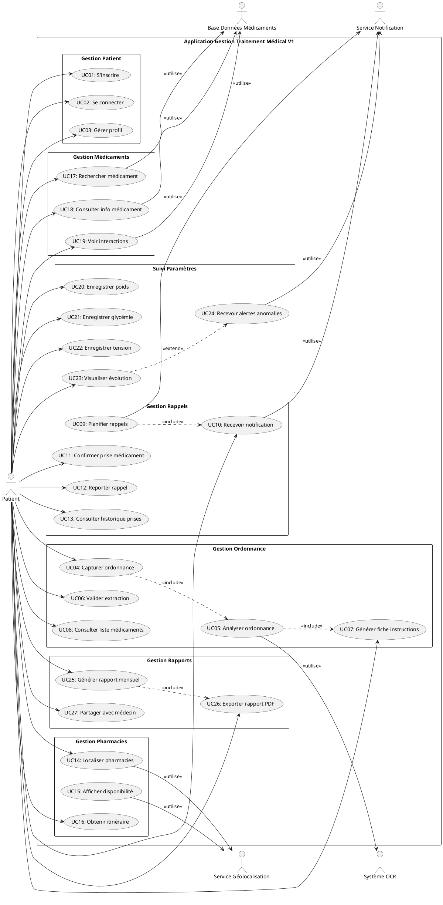

**Instructions pour tracer:**
1. Ouvrir PlantUML ou https://www.plantuml.com/plantuml/
2. Copier-coller le code ci-dessus
3. Compiler pour générer le diagramme
4. Exporter en PNG/SVG pour votre document

**Légende des éléments:**
- **Rectangle principal:** Frontière du système
- **Packages:** Regroupements fonctionnels
- **Ellipses (usecase):** Cas d'utilisation (UC01-UC27)
- **Acteurs (stick figure):** Utilisateurs et systèmes externes
- **Flèches pleines (-->):** Association acteur-cas d'utilisation
- **Flèches pointillées (..>):** Relations include/extend
- **<<include>>:** Le cas d'utilisation source inclut obligatoirement le cas cible
- **<<extend>>:** Extension conditionnelle
- **<<utilise>>:** Dépendance vers acteur système

---

### 5.2 Diagramme de Séquence Système (UC05: Analyser Ordonnance)

**Description:** Montre les interactions temporelles pour l'analyse d'une ordonnance.

#### Code PlantUML:

@startuml
title Diagramme de Séquence - Analyse d'Ordonnance\nUC05: Analyser le contenu via OCR

skinparam {
  BackgroundColor #FFFFFF
  ParticipantBackgroundColor #E3F2FD
  ParticipantBorderColor #1565C0
  ActorBackgroundColor #F3E5F5
  ActorBorderColor #7B1FA2
  LifeLineBackgroundColor #F5F5F5
  ArrowColor #424242
  SequenceMessageAlign reverse
}

actor "PATIENT" as Patient
participant "INTERFACE" as Interface
participant "CONTROLEUR\nORDONNANCE" as Controleur
participant "SERVICE\nOCR" as ServiceOCR
participant "PARSER\nMÉDICAMENTS" as Parser
participant "BASE DE\nDONNÉES" as BaseDonnees
participant "GÉNÉRATEUR\nFICHE" as Generateur

autonumber "<b>[00]</b>"

Patient -> Interface : "capturerOrdonnance(photo)"
activate Interface

Interface -> Controleur : "analyserImage(photo)"
activate Controleur

Controleur -> ServiceOCR : "traiterImageOCR(image)"
activate ServiceOCR

ServiceOCR -> ServiceOCR : "preprocessImage()"
ServiceOCR -> ServiceOCR : "appliquerModelOCR()"
ServiceOCR -> ServiceOCR : "extraireTexteBrut()"

ServiceOCR --> Controleur : "texteExtrait\n(string)"
deactivate ServiceOCR

Controleur -> Parser : "parserOrdonnance(texte)"
activate Parser

Parser -> Parser : "detecterMedicaments()"
Parser -> Parser : "extrairePosologies()"
Parser -> Parser : "extraireDuree()"

loop Pour chaque médicament détecté
    Parser -> BaseDonnees : "verifierMedicament(nom)"
    activate BaseDonnees
    BaseDonnees --> Parser : "infoMedicament\n(object)"
    deactivate BaseDonnees
    
    Parser -> Parser : "validerPosologie()"
    Parser -> Parser : "normaliserDonnees()"
end

Parser --> Controleur : "listeMedicaments\n(structurée)"
deactivate Parser

Controleur -> Generateur : "genererFiche(listeMedicaments)"
activate Generateur

Generateur -> Generateur : "createrInstructionsClaires()"
Generateur -> Generateur : "calculerHorairesPrise()"
Generateur -> Generateur : "genererAlerteInteractions()"

Generateur --> Controleur : "ficheInstructions\n(object)"
deactivate Generateur

Controleur -> Controleur : "sauvegarderResultats()"

Controleur --> Interface : "resultatAnalyse\n(fiche + liste)"
deactivate Controleur

Interface --> Patient : "afficherFicheEtValidation()"
deactivate Interface

Patient -> Interface : "confirmerExactitude()"

Interface -> Controleur : "validerEtSauvegarder()"
activate Controleur

Controleur -> BaseDonnees : "sauvegarderOrdonnance()"
activate BaseDonnees
BaseDonnees --> Controleur : "succes"
deactivate BaseDonnees

Controleur --> Interface : "confirmationSauvegarde"
deactivate Controleur

Interface --> Patient : "afficherConfirmationFinale()"

note right of Patient 
  <b>Flux principal:</b>
  1. Capture photo
  2. Analyse OCR
  3. Parsing intelligent
  4. Validation médicaments
  5. Génération fiche
  6. Confirmation utilisateur
end note

@enduml


**Instructions:**
- Représente le flux chronologique (numérotation automatique)
- `activate`/`deactivate` montrent la durée d'activation
- `alt`/`else` pour les alternatives
- `loop` pour les boucles

---

### 5.3 Diagramme de Séquence Détaillé (UC09: Planifier Rappels)

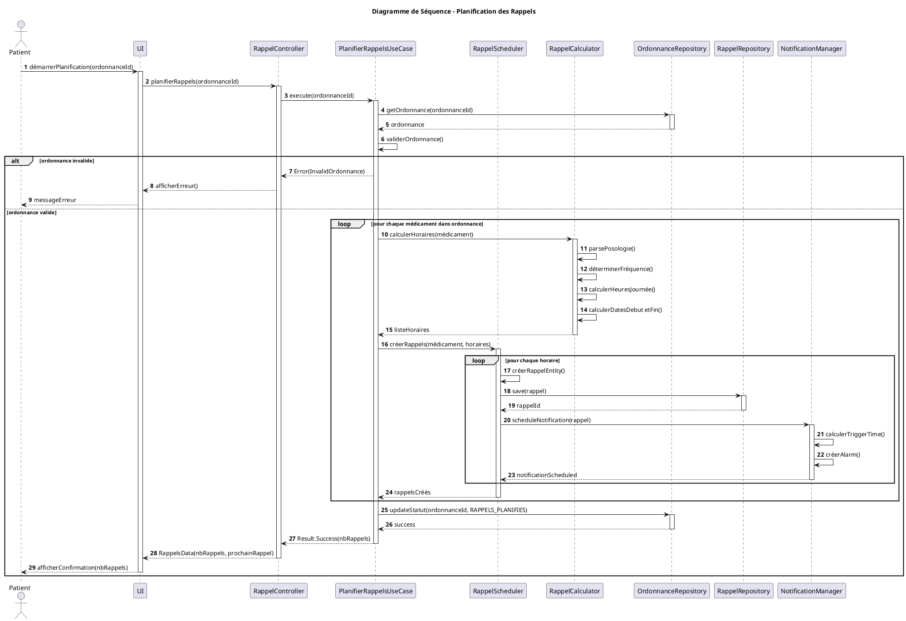

---

### 5.4 Diagramme de Classes (Complet)

**Description:** Architecture complète des classes du domaine métier.

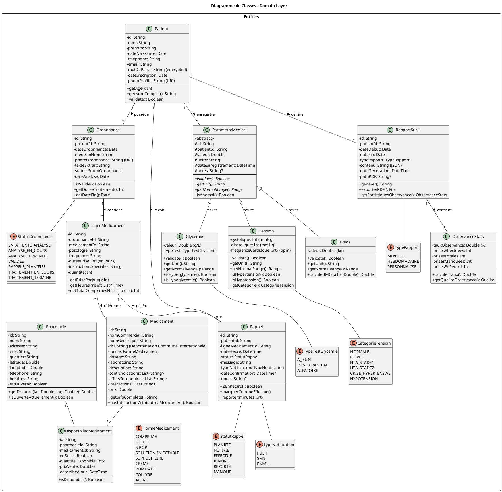

**Instructions de lecture:**
- **Rectangles:** Classes concrètes
- **Rectangles avec <<abstract>>:** Classes abstraites
- **Rectangles avec <<enum>>:** Énumérations
- **Attributs (-):** private
- **Attributs (#):** protected
- **Méthodes (+):** public
- **Flèches pleines:** Associations
- **Flèches avec triangle vide:** Héritage
- **Multiplicités:** "1" (un), "*" (plusieurs), "0..1" (optionnel)

---

### 5.5 Diagramme de Packages

**Description:** Organisation modulaire de l'architecture.

```plantuml
@startuml
title Diagramme de Packages - Architecture Modulaire

skinparam packageStyle rectangle

package "Presentation Layer" <<Rectangle>> #LightBlue {
    
    package "ui.patient" {
        [RegistrationActivity]
        [LoginActivity]
        [ProfileActivity]
    }
    
    package "ui.ordonnance" {
        [CaptureOrdonnanceActivity]
        [ValidationOrdonnanceActivity]
        [DetailOrdonnanceActivity]
        [ListeOrdonnancesActivity]
    }
    
    package "ui.rappels" {
        [ListeRappelsActivity]
        [ConfirmationPriseActivity]
        [HistoriquePrisesActivity]
    }
    
    package "ui.pharmacies" {
        [MapPharmaciesActivity]
        [ListePharmaciesActivity]
        [DetailPharmacieActivity]
    }
    
    package "ui.medicaments" {
        [RechercheMedicamentActivity]
        [DetailMedicamentActivity]
    }
    
    package "ui.suivi" {
        [SaisieParametresActivity]
        [GraphiquesEvolutionActivity]
        [RapportsActivity]
    }
    
    package "viewmodels" {
        [PatientViewModel]
        [OrdonnanceViewModel]
        [RappelViewModel]
        [PharmacieViewModel]
        [MedicamentViewModel]
        [ParametreMedicalViewModel]
        [RapportViewModel]
    }
}

package "Domain Layer" <<Rectangle>> #LightGreen {
    
    package "entities" {
        [Patient]
        [Ordonnance]
        [Medicament]
        [LigneMedicament]
        [Rappel]
        [Pharmacie]
        [ParametreMedical]
        [RapportSuivi]
    }
    
    package "usecases.patient" {
        [RegisterPatientUseCase]
        [LoginPatientUseCase]
        [UpdateProfileUseCase]
        [GetPatientUseCase]
    }
    
    package "usecases.ordonnance" {
        [CaptureOrdonnanceUseCase]
        [AnalyzerOrdonnanceUseCase]
        [ValidateOrdonnanceUseCase]
        [GetOrdonnancesUseCase]
        [GenerateFicheInstructionsUseCase]
    }
    
    package "usecases.rappel" {
        [PlanifierRappelsUseCase]
        [ConfirmerPriseUseCase]
        [ReporterRappelUseCase]
        [GetHistoriquePrisesUseCase]
        [GetProchainRappelUseCase]
    }
    
    package "usecases.pharmacie" {
        [LocaliserPharmaciesUseCase]
        [GetDisponibiliteMedicamentUseCase]
        [CalculateItineraireUseCase]
    }
    
    package "usecases.medicament" {
        [SearchMedicamentUseCase]
        [GetMedicamentDetailsUseCase]
        [CheckInteractionsUseCase]
    }
    
    package "usecases.suivi" {
        [EnregistrerPoidsUseCase]
        [EnregistrerGlycemieUseCase]
        [EnregistrerTensionUseCase]
        [GetEvolutionParametresUseCase]
        [DetecterAnomaliesUseCase]
    }
    
    package "usecases.rapport" {
        [GenerateRapportMensuelUseCase]
        [ExportRapportPDFUseCase]
        [CalculateObservanceUseCase]
    }
    
    package "repositories.interfaces" {
        [IPatientRepository]
        [IOrdonnanceRepository]
        [IMedicamentRepository]
        [IRappelRepository]
        [IPharmacieRepository]
        [IParametreMedicalRepository]
        [IRapportRepository]
    }
}

package "Data Layer" <<Rectangle>> #LightYellow {
    
    package "repositories.impl" {
        [PatientRepositoryImpl]
        [OrdonnanceRepositoryImpl]
        [MedicamentRepositoryImpl]
        [RappelRepositoryImpl]
        [PharmacieRepositoryImpl]
        [ParametreMedicalRepositoryImpl]
        [RapportRepositoryImpl]
    }
    
    package "local.database" {
        [AppDatabase]
        [PatientDao]
        [OrdonnanceDao]
        [MedicamentDao]
        [RappelDao]
        [ParametreMedicalDao]
    }
    
    package "local.entities" {
        [PatientEntity]
        [OrdonnanceEntity]
        [MedicamentEntity]
        [RappelEntity]
        [ParametreMedicalEntity]
    }
    
    package "remote.api" {
        [OCRApiService]
        [PharmacieApiService]
        [MedicamentApiService]
    }
    
    package "remote.dto" {
        [OCRResponseDTO]
        [PharmacieDTO]
        [MedicamentDTO]
    }
}

package "Infrastructure Layer" <<Rectangle>> #LightCoral {
    
    package "services" {
        [OCRService]
        [GeolocationService]
        [NotificationService]
        [ImageProcessingService]
        [PDFGenerationService]
    }
    
    package "utils" {
        [DateTimeUtils]
        [ValidationUtils]
        [EncryptionUtils]
        [NetworkUtils]
    }
    
    package "di" {
        [AppModule]
        [DatabaseModule]
        [NetworkModule]
        [RepositoryModule]
        [UseCaseModule]
    }
}

' Dépendances entre packages
[Presentation Layer] ..> [Domain Layer] : utilise
[Domain Layer] ..> [Data Layer] : dépend
[Data Layer] ..> [Infrastructure Layer] : utilise
[Presentation Layer] ..> [Infrastructure Layer] : utilise

' Dépendances spécifiques
viewmodels ..> usecases.patient
viewmodels ..> usecases.ordonnance
viewmodels ..> usecases.rappel
viewmodels ..> usecases.pharmacie
viewmodels ..> usecases.medicament
viewmodels ..> usecases.suivi
viewmodels ..> usecases.rapport

usecases.patient ..> repositories.interfaces
usecases.ordonnance ..> repositories.interfaces
usecases.rappel ..> repositories.interfaces
usecases.pharmacie ..> repositories.interfaces
usecases.medicament ..> repositories.interfaces
usecases.suivi ..> repositories.interfaces
usecases.rapport ..> repositories.interfaces

repositories.impl ..|> repositories.interfaces : implémente
repositories.impl ..> local.database
repositories.impl ..> remote.api

note right of "Domain Layer"
  Couche métier pure
  Aucune dépendance externe
  Logique business isolée
end note

note right of "Presentation Layer"
  UI et ViewModels
  Dépend uniquement du Domain
  Pattern MVVM
end note

note right of "Data Layer"
  Implémentation des repositories
  Gestion données locales/distantes
  Pattern Repository
end note

note right of "Infrastructure Layer"
  Services techniques
  Utilitaires
  Injection de dépendances
end note

@enduml
```

---

### 5.6 Diagramme de Composants

**Description:** Architecture technique des composants applicatifs.

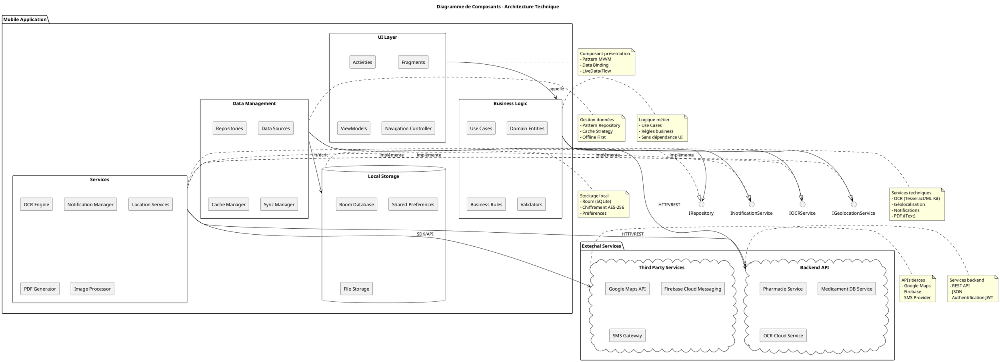

---

### 5.7 Diagramme d'Architecture (Déploiement)

```plantuml
@startuml
title Diagramme de Déploiement - Architecture Physique

skinparam nodeStyle rectangle

node "Smartphone Android/iOS" as phone {
    artifact "Application Mobile" as app {
        component [UI Layer]
        component [Business Layer]
        component [Data Layer]
    }
    
    database "Base Locale\n(Room/SQLite)" as localdb
    
    folder "Stockage Local" as storage {
        file "Photos Ordonnances"
        file "Rapports PDF"
        file "Cache"
    }
}

node "Serveur Backend\n(Cloud)" as backend {
    artifact "API REST" as api {
        component [Pharmacie Service]
        component [Medicament Service]
        component [OCR Service]
    }
    
    database "Base de Données\nPostgreSQL" as db {
        schema "Pharmacies"
        schema "Medicaments"
        schema "Disponibilités"
    }
}

node "Services Externes" as external {
    cloud "Google Maps API" as gmaps
    cloud "Firebase" as firebase {
        component [Cloud Messaging]
        component [Analytics]
    }
    cloud "Tesseract OCR\n(Local)" as ocr
}

node "SMS Gateway" as sms {
    component [SMS Provider\nCameroun]
}

' Connexions
app -down-> localdb : JDBC/Room
app -down-> storage : File I/O
app -right-> api : HTTPS/REST
api -down-> db : SQL
app -up-> gmaps : REST API
app -up-> firebase : SDK
app -up-> ocr : Library
api -right-> sms : HTTP API

' Protocoles
app -[#blue]-> api : <<HTTPS>>\n<<JSON>>
app -[#green]-> gmaps : <<REST>>
app -[#orange]-> firebase : <<FCM>>
api -[#purple]-> sms : <<HTTP>>

' Notes
note right of phone
  **Environnement mobile**
  - Android 8+ / iOS 13+
  - Stockage chiffré
  - Mode offline
  - Sync automatique
end note

note right of backend
  **Cloud Infrastructure**
  - Hébergement: AWS/Azure
  - Auto-scaling
  - Load balancing
  - SSL/TLS
end note

note bottom of external
  **Services tiers**
  - Géolocalisation
  - Notifications push
  - OCR (fallback cloud)
  - Analytics
end note

note bottom of sms
  **SMS Gateway**
  - Provider local (Cameroun)
  - Orange/MTN API
  - Backup notifications
end note

@enduml
```

---

### 5.8 Diagramme d'États (Cycle de vie Ordonnance)

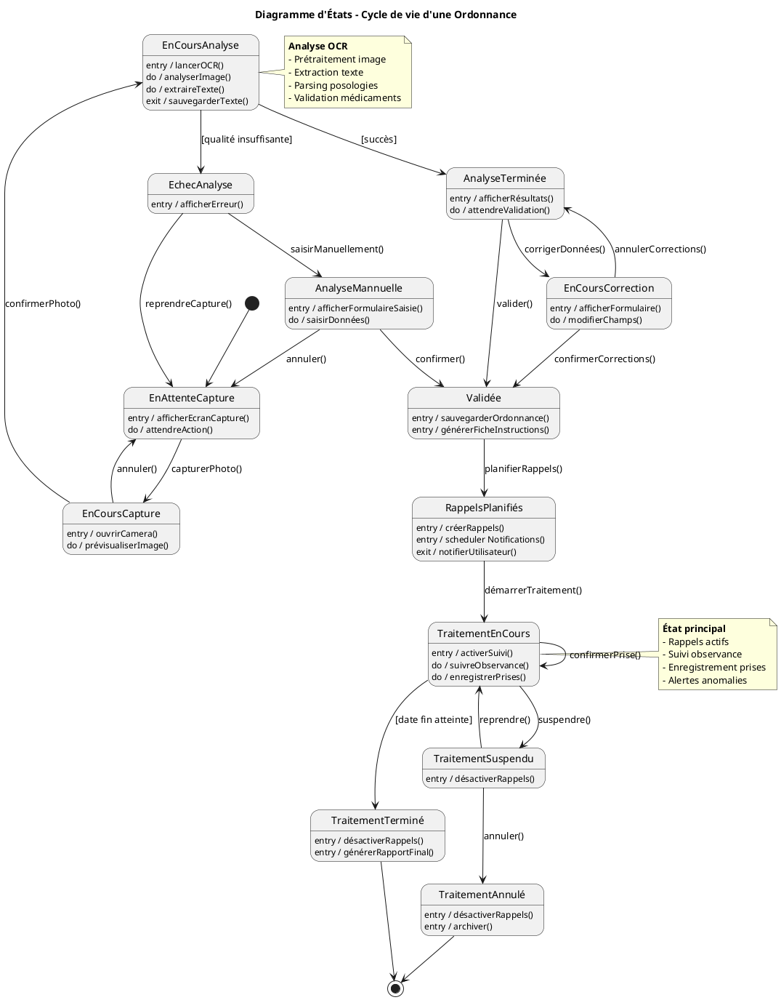

---

### 5.9 Diagramme d'États (Cycle de vie Rappel)

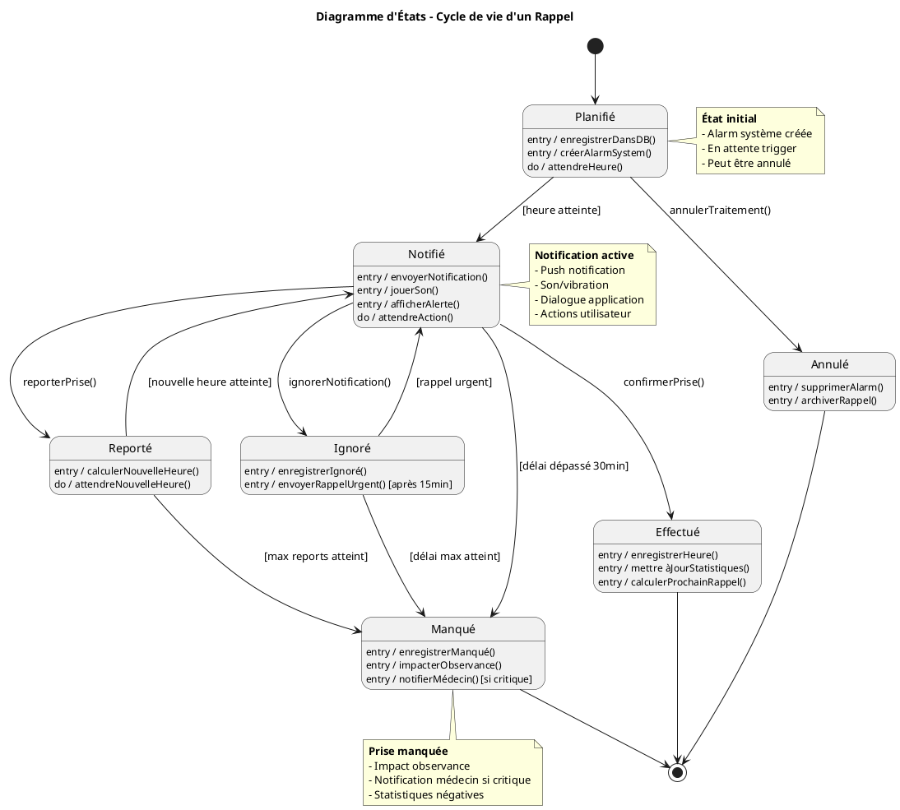

---

### 5.10 Diagramme d'Activités (Processus complet: De la capture à la planification)

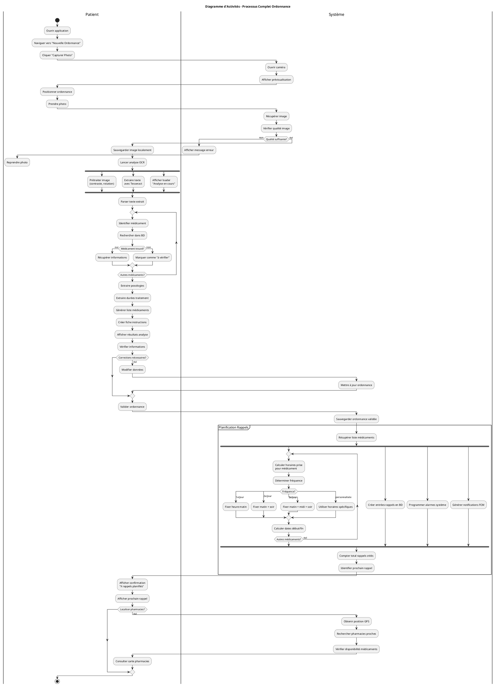

---

### 5.11 Diagramme d'Activités (Gestion notification rappel)

```plantuml
@startuml
title Diagramme d'Activités - Gestion Notification Rappel

|Système Notification|
start
:Alarm système se déclenche;
:Récupérer détails rappel de BD;
:Construire message notification;

fork
  :Préparer notification push;
  :Définir son/vibration;
  :Créer actions (Prise/Reporter);
fork again
  if (SMS activé?) then (oui)
    :Envoyer SMS rappel;
  endif
end fork

:Afficher notification;
:Démarrer timer 30min;

|Patient|

split
  -> Notification push affichée;
  :Consulter notification;
  
  if (Action?) then (Confirmer prise)
    |Système|
    :Enregistrer confirmation;
    :Timestamp prise effective;
    :Mettre à jour statut "EFFECTUÉ";
    :Calculer temps response;
    
    if (Paramètres à enregistrer?) then (oui)
      |Patient|
      :Saisir paramètres\n(optionnel);
      |Système|
      :Sauvegarder paramètres;
    endif
    
    :Mettre à jour observance;
    :Annuler timer;
    stop
    
  else (Reporter)
    |Patient|
    :Choisir durée report\n(15/30/60 min);
    
    |Système|
    :Incrémenter compteur reports;
    
    if (Max reports atteint?) then (oui)
      :Marquer "MANQUÉ";
      :Envoyer notification urgente;
      stop
    else (non)
      :Calculer nouvelle heure;
      :Reprogrammer alarm;
      :Mettre à jour statut "REPORTÉ";
      detach
    endif
    
  else (Ignorer)
    |Système|
    :Marquer statut "IGNORÉ";
    :Programmer rappel urgent +15min;
    detach
  endif

split again
  -> Timer 30min expire;
  |Système|
  if (Statut toujours "NOTIFIÉ"?) then (oui)
    :Marquer "MANQUÉ";
    :Enregistrer dans historique;
    :Impacter score observance;
    :Calculer impact traitement;
    
    if (Médicament critique?) then (oui)
      :Envoyer notification urgente;
      :Alerter contact urgence\n(optionnel V2);
    endif
    
    :Générer notification manquée;
    stop
  endif
end split

@enduml
```

---

## 6. ITÉRATIONS DE DÉVELOPPEMENT {#iterations}

### 6.1 Vue d'ensemble des Itérations

| Itération | Durée | Fonctionnalités | Livrable |
|-----------|-------|----------------|----------|
| **Sprint 1** | 10 jours | Gestion patients + Analyse ordonnances | MVP Analyse |
| **Sprint 2** | 10 jours | Rappels + Localisation pharmacies | MVP Rappels |
| **Sprint 3** | 14 jours | Recherche médicaments + Suivi paramètres + Rapports | MVP Suivi |
| **Sprint 4** | 14 jours | Tests + Production + Déploiement | Version 1.0 |

### 6.2 Sprint 1 - Fondations (10 jours)

#### Objectif
Mettre en place l'architecture de base et les fonctionnalités d'enregistrement/analyse.

#### User Stories
- **US-01**: En tant que patient, je veux créer un compte pour accéder à l'application
- **US-02**: En tant que patient, je veux me connecter de manière sécurisée
- **US-03**: En tant que patient, je veux capturer une photo de mon ordonnance
- **US-04**: En tant que patient, je veux que l'application analyse automatiquement mon ordonnance
- **US-05**: En tant que patient, je veux voir la liste des médicaments extraits
- **US-06**: En tant que patient, je veux corriger les informations si nécessaire
- **US-07**: En tant que patient, je veux consulter ma fiche d'instructions

#### Tâches Techniques
1. **Architecture (2 jours)**
   - Setup projet Android/iOS
   - Configuration Clean Architecture
   - Setup Room Database
   - Configuration Dependency Injection (Hilt)
   - Setup navigation

2. **Module Patient (2 jours)**
   - Création entities Patient
   - Repository pattern
   - Use cases: Register, Login, GetProfile
   - UI: Écrans inscription/connexion
   - Validation + Chiffrement mot de passe

3. **Module Ordonnance - Capture (3 jours)**
   - Entity Ordonnance + LigneMedicament
   - Intégration caméra (CameraX)
   - Validation qualité image
   - Stockage local images
   - UI: Écran capture avec prévisualisation

4. **Module Ordonnance - Analyse (3 jours)**
   - Intégration Tesseract OCR
   - Prétraitement images
   - Parser texte médical
   - Extraction posologies
   - Génération fiche instructions
   - UI: Écran résultats + validation

#### Critères d'Acceptation Sprint 1
- ✅ Un patient peut créer un compte et se connecter
- ✅ Un patient peut capturer une ordonnance
- ✅ L'OCR extrait au moins 80% des informations correctement
- ✅ Les données sont sauvegardées localement (chiffrées)
- ✅ Une fiche d'instructions est générée
- ✅ Le patient peut corriger les erreurs d'extraction

#### Diagramme de Séquence Sprint 1 (Flux principal)

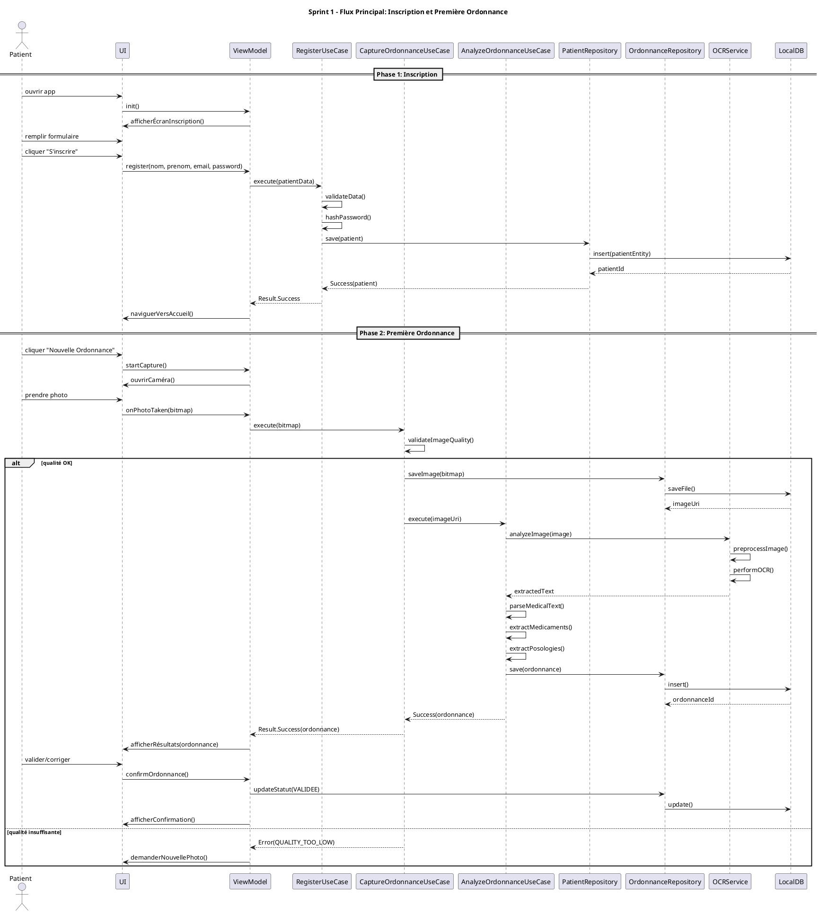

---

### 6.3 Sprint 2 - Rappels et Pharmacies (10 jours)

#### Objectif
Implémenter le système de rappels intelligents et la localisation des pharmacies.

#### User Stories
- **US-08**: En tant que patient, je veux que l'app planifie automatiquement mes rappels
- **US-09**: En tant que patient, je veux recevoir des notifications aux heures de prise
- **US-10**: En tant que patient, je veux confirmer que j'ai pris mon médicament
- **US-11**: En tant que patient, je veux reporter un rappel si nécessaire
- **US-12**: En tant que patient, je veux consulter mon historique de prises
- **US-13**: En tant que patient, je veux localiser les pharmacies proches
- **US-14**: En tant que patient, je veux voir quelles pharmacies ont mes médicaments

#### Tâches Techniques
1. **Module Rappels - Calcul et Planification (3 jours)**
   - Entity Rappel
   - RappelCalculator: calcul horaires
   - RappelScheduler: planification
   - Use case: PlanifierRappelsUseCase
   - Algorithmes de calcul fréquences

2. **Module Rappels - Notifications (2 jours)**
   - NotificationService (local)
   - AlarmManager integration
   - WorkManager pour rappels persistants
   - Notification actions (Confirmer/Reporter)
   - Handlers pour actions

3. **Module Rappels - Gestion (2 jours)**
   - Use cases: Confirmer, Reporter, GetHistorique
   - Calcul observance
   - Repository pattern
   - UI: Liste rappels, historique

4. **Module Pharmacies (3 jours)**
   - Entity Pharmacie + DisponibiliteMedicament
   - GeolocationService
   - PharmacieRepository (mock data pour MVP)
   - Calcul distances
   - Use case: LocaliserPharmaciesUseCase
   - UI: Carte + liste pharmacies (Google Maps)

#### Critères d'Acceptation Sprint 2
- ✅ Les rappels sont automatiquement générés après validation ordonnance
- ✅ Les notifications apparaissent aux heures programmées
- ✅ Le patient peut confirmer ou reporter une prise
- ✅ L'historique affiche toutes les prises (effectuées/manquées)
- ✅ La carte montre les pharmacies dans un rayon de 5km
- ✅ Les pharmacies affichent la disponibilité simulée des médicaments

#### Diagramme de Séquence Sprint 2 (Planification + Notification)

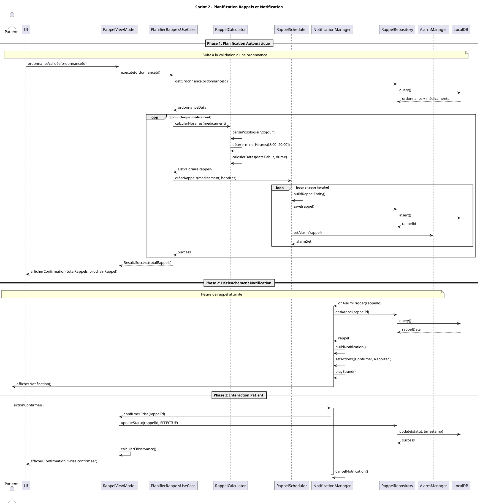

---

### 6.4 Sprint 3 - Suivi Médical et Rapports (14 jours)

#### Objectif
Compléter l'application avec la recherche de médicaments, le suivi des paramètres vitaux et la génération de rapports.

#### User Stories
- **US-15**: En tant que patient, je veux rechercher des informations sur un médicament
- **US-16**: En tant que patient, je veux voir les effets secondaires et contre-indications
- **US-17**: En tant que patient, je veux vérifier les interactions médicamenteuses
- **US-18**: En tant que patient, je veux enregistrer mon poids régulièrement
- **US-19**: En tant que patient, je veux enregistrer ma glycémie
- **US-20**: En tant que patient, je veux enregistrer ma tension artérielle
- **US-21**: En tant que patient, je veux visualiser l'évolution de mes paramètres
- **US-22**: En tant que patient, je veux être alerté en cas d'anomalie
- **US-23**: En tant que patient, je veux générer un rapport mensuel
- **US-24**: En tant que patient, je veux exporter le rapport en PDF

#### Tâches Techniques
1. **Module Médicaments (3 jours)**
   - Base de données médicaments (SQLite pré-remplie)
   - MedicamentRepository
   - Use cases: Search, GetDetails, CheckInteractions
   - Algorithme de recherche (fuzzy matching)
   - UI: Recherche + détails médicament

2. **Module Paramètres Médicaux (4 jours)**
   - Entities abstraites: ParametreMedical
   - Entities concrètes: Poids, Glycemie, Tension
   - Validation des valeurs
   - Détection anomalies
   - ParametreMedicalRepository
   - Use cases: Enregistrer, GetEvolution, DetecterAnomalies
   - UI: Formulaires saisie + graphiques (MPAndroidChart)

3. **Module Rapports (4 jours)**
   - Entity RapportSuivi
   - Calcul statistiques observance
   - Agrégation données paramètres
   - Génération contenu JSON
   - PDF Generator (iText library)
   - Templates PDF
   - Use cases: GenererRapport, ExportPDF
   - UI: Visualisation + partage

4. **Intégrations et Polish (3 jours)**
   - Corrélations paramètres/prises
   - Alertes intelligentes
   - Optimisations performances
   - Tests d'intégration
   - UX improvements

#### Critères d'Acceptation Sprint 3
- ✅ La recherche trouve les médicaments même avec fautes d'orthographe
- ✅ Les informations médicamenteuses sont complètes et précises
- ✅ Les interactions sont détectées et affichées
- ✅ Les 3 types de paramètres peuvent être enregistrés
- ✅ Les graphiques affichent l'évolution sur 30 jours
- ✅ Les alertes se déclenchent pour valeurs anormales
- ✅ Le rapport PDF contient toutes les données du mois
- ✅ Le rapport est partageable (email, WhatsApp)

#### Diagramme de Séquence Sprint 3 (Génération Rapport)

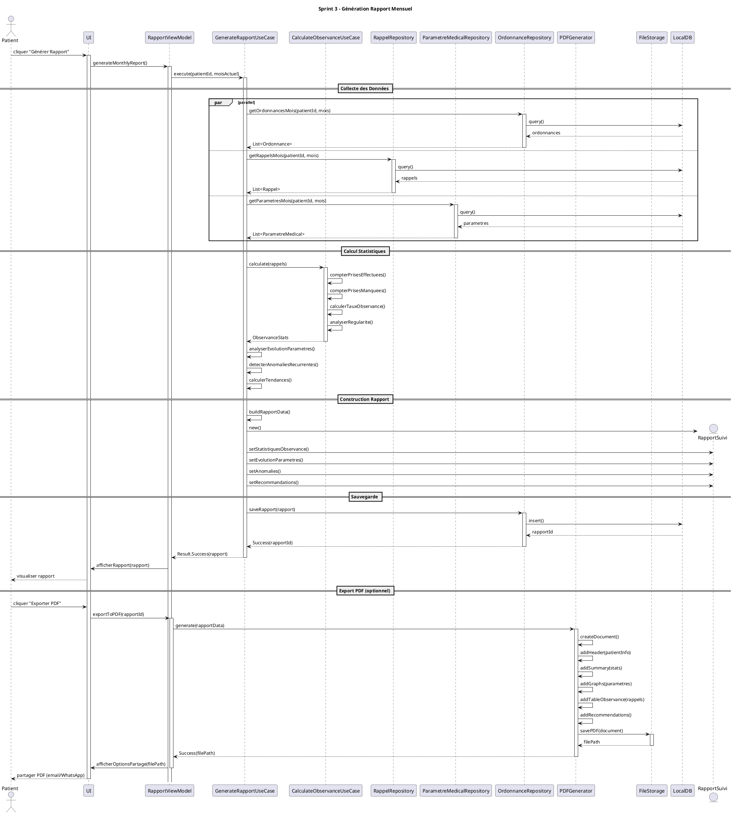

---

### 6.5 Sprint 4 - Tests et Déploiement (14 jours)

#### Objectif
Assurer la qualité, produire les builds finaux et déployer sur les stores.

#### Activités Principales

**Semaine 1 - Tests (7 jours)**

1. **Tests Unitaires (2 jours)**
   - Use cases: couverture 80%+
   - Repositories: couverture 80%+
   - Validators: couverture 100%
   - Utilities: couverture 100%
   - Framework: JUnit, Mockito

2. **Tests d'Intégration (2 jours)**
   - Flux complets end-to-end
   - Tests base de données
   - Tests repositories
   - Framework: Android Test, Room Testing

3. **Tests UI (1 jour)**
   - Tests navigation
   - Tests formulaires
   - Tests listes/scrolling
   - Framework: Espresso

4. **Tests Manuels (2 jours)**
   - Scénarios utilisateurs réels
   - Tests sur différents appareils
   - Tests offline/online
   - Tests notifications
   - Tests performances

**Semaine 2 - Production et Déploiement (7 jours)**

1. **Préparation Production (2 jours)**
   - Configuration ProGuard/R8
   - Optimisation APK/IPA
   - Configuration signing keys
   - Removal logs debug
   - Versioning (1.0.0)

2. **Build Android (1 jour)**
   - Génération APK release
   - Génération AAB (Android App Bundle)
   - Tests sur appareils physiques
   - Validation ProGuard

3. **Build iOS (1 jour)**
   - Configuration certificates
   - Génération IPA
   - Tests sur appareils physiques
   - Validation App Transport Security

4. **Création Assets Store (1 jour)**
   - Screenshots (5+ par plateforme)
   - Icône application (toutes résolutions)
   - Feature graphic
   - Descriptions (FR/EN)
   - Vidéo démo (optionnel)

5. **Déploiement (2 jours)**
   - Google Play Console: Upload AAB
   - Apple App Store Connect: Upload IPA
   - Remplir métadonnées
   - Définir pricing (Gratuit)
   - Soumettre pour review
   - Monitoring première review

#### Critères de Qualité Sprint 4
- ✅ Couverture tests > 75%
- ✅ Aucun crash critique
- ✅ Temps de lancement < 3s
- ✅ Temps réponse UI < 300ms
- ✅ Builds signés et optimisés
- ✅ Applications publiées sur stores
- ✅ Documentation technique complète

---

## 7. MODÈLES DE DONNÉES {#modeles}

### 7.1 Modèle Entité-Relation (Base de Données)

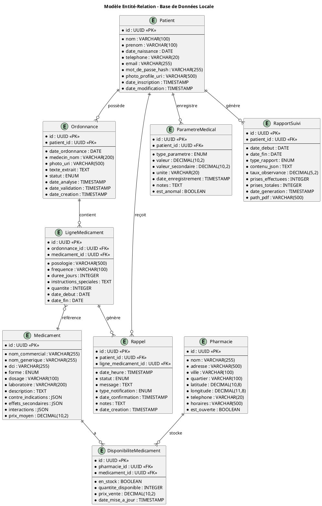

---

### 7.2 Schéma SQL Complet (Room Database)

```sql
-- Table Patient
CREATE TABLE patient (
    id TEXT PRIMARY KEY NOT NULL,
    nom TEXT NOT NULL,
    prenom TEXT NOT NULL,
    date_naissance INTEGER NOT NULL,
    telephone TEXT NOT NULL UNIQUE,
    email TEXT NOT NULL UNIQUE,
    mot_de_passe_hash TEXT NOT NULL,
    photo_profile_uri TEXT,
    date_inscription INTEGER NOT NULL,
    date_modification INTEGER NOT NULL
);

CREATE INDEX idx_patient_email ON patient(email);
CREATE INDEX idx_patient_telephone ON patient(telephone);

-- Table Ordonnance
CREATE TABLE ordonnance (
    id TEXT PRIMARY KEY NOT NULL,
    patient_id TEXT NOT NULL,
    date_ordonnance INTEGER NOT NULL,
    medecin_nom TEXT,
    photo_uri TEXT NOT NULL,
    texte_extrait TEXT,
    statut TEXT NOT NULL CHECK(statut IN ('EN_ATTENTE_ANALYSE', 'ANALYSE_EN_COURS', 
        'ANALYSE_TERMINEE', 'VALIDEE', 'RAPPELS_PLANIFIES', 
        'TRAITEMENT_EN_COURS', 'TRAITEMENT_TERMINE')),
    date_analyse INTEGER,
    date_validation INTEGER,
    date_creation INTEGER NOT NULL,
    FOREIGN KEY(patient_id) REFERENCES patient(id) ON DELETE CASCADE
);

CREATE INDEX idx_ordonnance_patient ON ordonnance(patient_id);
CREATE INDEX idx_ordonnance_statut ON ordonnance(statut);
CREATE INDEX idx_ordonnance_date ON ordonnance(date_ordonnance DESC);

-- Table Medicament
CREATE TABLE medicament (
    id TEXT PRIMARY KEY NOT NULL,
    nom_commercial TEXT NOT NULL,
    nom_generique TEXT,
    dci TEXT,
    forme TEXT NOT NULL CHECK(forme IN ('COMPRIME', 'GELULE', 'SIROP', 
        'SOLUTION_INJECTABLE', 'SUPPOSITOIRE', 'CREME', 'POMMADE', 
        'COLLYRE', 'AUTRE')),
    dosage TEXT NOT NULL,
    laboratoire TEXT,
    description TEXT,
    contre_indications TEXT,
    effets_secondaires TEXT,
    interactions TEXT,
    prix_moyen REAL
);

CREATE INDEX idx_medicament_nom_commercial ON medicament(nom_commercial);
CREATE INDEX idx_medicament_nom_generique ON medicament(nom_generique);
CREATE INDEX idx_medicament_dci ON medicament(dci);

-- Table pour recherche full-text
CREATE VIRTUAL TABLE medicament_fts USING fts4(
    content='medicament',
    nom_commercial,
    nom_generique,
    dci
);

-- Table LigneMedicament
CREATE TABLE ligne_medicament (
    id TEXT PRIMARY KEY NOT NULL,
    ordonnance_id TEXT NOT NULL,
    medicament_id TEXT NOT NULL,
    posologie TEXT NOT NULL,
    frequence TEXT NOT NULL,
    duree_jours INTEGER NOT NULL,
    instructions_speciales TEXT,
    quantite INTEGER NOT NULL,
    date_debut INTEGER NOT NULL,
    date_fin INTEGER NOT NULL,
    FOREIGN KEY(ordonnance_id) REFERENCES ordonnance(id) ON DELETE CASCADE,
    FOREIGN KEY(medicament_id) REFERENCES medicament(id)
);

CREATE INDEX idx_ligne_ordonnance ON ligne_medicament(ordonnance_id);
CREATE INDEX idx_ligne_medicament ON ligne_medicament(medicament_id);

-- Table Rappel
CREATE TABLE rappel (
    id TEXT PRIMARY KEY NOT NULL,
    patient_id TEXT NOT NULL,
    ligne_medicament_id TEXT NOT NULL,
    date_heure INTEGER NOT NULL,
    statut TEXT NOT NULL CHECK(statut IN ('PLANIFIE', 'NOTIFIE', 
        'EFFECTUE', 'IGNORE', 'REPORTE', 'MANQUE')),
    message TEXT NOT NULL,
    type_notification TEXT NOT NULL CHECK(type_notification IN ('PUSH', 'SMS', 'EMAIL')),
    date_confirmation INTEGER,
    notes TEXT,
    date_creation INTEGER NOT NULL,
    FOREIGN KEY(patient_id) REFERENCES patient(id) ON DELETE CASCADE,
    FOREIGN KEY(ligne_medicament_id) REFERENCES ligne_medicament(id) ON DELETE CASCADE
);

CREATE INDEX idx_rappel_patient ON rappel(patient_id);
CREATE INDEX idx_rappel_date_heure ON rappel(date_heure);
CREATE INDEX idx_rappel_statut ON rappel(statut);
CREATE INDEX idx_rappel_ligne ON rappel(ligne_medicament_id);

-- Table Pharmacie
CREATE TABLE pharmacie (
    id TEXT PRIMARY KEY NOT NULL,
    nom TEXT NOT NULL,
    adresse TEXT NOT NULL,
    ville TEXT NOT NULL,
    quartier TEXT,
    latitude REAL NOT NULL,
    longitude REAL NOT NULL,
    telephone TEXT,
    horaires TEXT,
    est_ouverte INTEGER NOT NULL DEFAULT 1
);

CREATE INDEX idx_pharmacie_ville ON pharmacie(ville);
CREATE INDEX idx_pharmacie_quartier ON pharmacie(quartier);
CREATE INDEX idx_pharmacie_location ON pharmacie(latitude, longitude);

-- Table DisponibiliteMedicament
CREATE TABLE disponibilite_medicament (
    id TEXT PRIMARY KEY NOT NULL,
    pharmacie_id TEXT NOT NULL,
    medicament_id TEXT NOT NULL,
    en_stock INTEGER NOT NULL DEFAULT 0,
    quantite_disponible INTEGER,
    prix_vente REAL,
    date_mise_a_jour INTEGER NOT NULL,
    FOREIGN KEY(pharmacie_id) REFERENCES pharmacie(id) ON DELETE CASCADE,
    FOREIGN KEY(medicament_id) REFERENCES medicament(id) ON DELETE CASCADE,
    UNIQUE(pharmacie_id, medicament_id)
);

CREATE INDEX idx_disponibilite_pharmacie ON disponibilite_medicament(pharmacie_id);
CREATE INDEX idx_disponibilite_medicament ON disponibilite_medicament(medicament_id);
CREATE INDEX idx_disponibilite_stock ON disponibilite_medicament(en_stock);

-- Table ParametreMedical
CREATE TABLE parametre_medical (
    id TEXT PRIMARY KEY NOT NULL,
    patient_id TEXT NOT NULL,
    type_parametre TEXT NOT NULL CHECK(type_parametre IN ('POIDS', 'GLYCEMIE', 'TENSION')),
    valeur REAL NOT NULL,
    valeur_secondaire REAL,
    unite TEXT NOT NULL,
    date_enregistrement INTEGER NOT NULL,
    notes TEXT,
    est_anomal INTEGER NOT NULL DEFAULT 0,
    FOREIGN KEY(patient_id) REFERENCES patient(id) ON DELETE CASCADE
);

CREATE INDEX idx_parametre_patient ON parametre_medical(patient_id);
CREATE INDEX idx_parametre_type ON parametre_medical(type_parametre);
CREATE INDEX idx_parametre_date ON parametre_medical(date_enregistrement DESC);
CREATE INDEX idx_parametre_anomal ON parametre_medical(est_anomal);

-- Table RapportSuivi
CREATE TABLE rapport_suivi (
    id TEXT PRIMARY KEY NOT NULL,
    patient_id TEXT NOT NULL,
    date_debut INTEGER NOT NULL,
    date_fin INTEGER NOT NULL,
    type_rapport TEXT NOT NULL CHECK(type_rapport IN ('MENSUEL', 'HEBDOMADAIRE', 'PERSONNALISE')),
    contenu_json TEXT NOT NULL,
    taux_observance REAL NOT NULL,
    prises_effectuees INTEGER NOT NULL,
    prises_totales INTEGER NOT NULL,
    date_generation INTEGER NOT NULL,
    path_pdf TEXT,
    FOREIGN KEY(patient_id) REFERENCES patient(id) ON DELETE CASCADE
);

CREATE INDEX idx_rapport_patient ON rapport_suivi(patient_id);
CREATE INDEX idx_rapport_date ON rapport_suivi(date_generation DESC);
CREATE INDEX idx_rapport_type ON rapport_suivi(type_rapport);

-- Triggers pour mise à jour automatique

-- Trigger: Mettre à jour date_modification du patient
CREATE TRIGGER update_patient_timestamp 
AFTER UPDATE ON patient
FOR EACH ROW
BEGIN
    UPDATE patient SET date_modification = strftime('%s', 'now') * 1000
    WHERE id = NEW.id;
END;

-- Trigger: Synchroniser FTS medicament
CREATE TRIGGER medicament_fts_insert AFTER INSERT ON medicament
BEGIN
    INSERT INTO medicament_fts(docid, nom_commercial, nom_generique, dci)
    VALUES (NEW.rowid, NEW.nom_commercial, NEW.nom_generique, NEW.dci);
END;

CREATE TRIGGER medicament_fts_update AFTER UPDATE ON medicament
BEGIN
    UPDATE medicament_fts SET 
        nom_commercial = NEW.nom_commercial,
        nom_generique = NEW.nom_generique,
        dci = NEW.dci
    WHERE docid = NEW.rowid;
END;

CREATE TRIGGER medicament_fts_delete AFTER DELETE ON medicament
BEGIN
    DELETE FROM medicament_fts WHERE docid = OLD.rowid;
END;
```

---

## 8. ARCHITECTURE DÉTAILLÉE {#architecture}

### 8.1 Structure des Packages (Android Kotlin)

```
com.medicalapp.v1/
│
├── presentation/
│   ├── MainActivity.kt
│   ├── navigation/
│   │   └── NavGraph.kt
│   │
│   ├── patient/
│   │   ├── RegistrationActivity.kt
│   │   ├── LoginActivity.kt
│   │   ├── ProfileActivity.kt
│   │   └── PatientViewModel.kt
│   │
│   ├── ordonnance/
│   │   ├── CaptureOrdonnanceActivity.kt
│   │   ├── ValidationOrdonnanceActivity.kt
│   │   ├── DetailOrdonnanceActivity.kt
│   │   ├── ListeOrdonnancesActivity.kt
│   │   └── OrdonnanceViewModel.kt
│   │
│   ├── rappel/
│   │   ├── ListeRappelsActivity.kt
│   │   ├── ConfirmationPriseActivity.kt
│   │   ├── HistoriquePrisesActivity.kt
│   │   └── RappelViewModel.kt
│   │
│   ├── pharmacie/
│   │   ├── MapPharmaciesActivity.kt
│   │   ├── ListePharmaciesActivity.kt
│   │   ├── DetailPharmacieActivity.kt
│   │   └── PharmacieViewModel.kt
│   │
│   ├── medicament/
│   │   ├── RechercheMedicamentActivity.kt
│   │   ├── DetailMedicamentActivity.kt
│   │   └── MedicamentViewModel.kt
│   │
│   ├── suivi/
│   │   ├── SaisieParametresActivity.kt
│   │   ├── GraphiquesEvolutionActivity.kt
│   │   ├── RapportsActivity.kt
│   │   └── SuiviViewModel.kt
│   │
│   └── common/
│       ├── BaseActivity.kt
│       ├── BaseFragment.kt
│       ├── LoadingDialog.kt
│       └── adapters/
│
├── domain/
│   ├── entities/
│   │   ├── Patient.kt
│   │   ├── Ordonnance.kt
│   │   ├── Medicament.kt
│   │   ├── LigneMedicament.kt
│   │   ├── Rappel.kt
│   │   ├── Pharmacie.kt
│   │   ├── DisponibiliteMedicament.kt
│   │   ├── ParametreMedical.kt
│   │   ├── Poids.kt
│   │   ├── Glycemie.kt
│   │   ├── Tension.kt
│   │   ├── RapportSuivi.kt
│   │   └── ObservanceStats.kt
│   │
│   ├── usecases/
│   │   ├── patient/
│   │   │   ├── RegisterPatientUseCase.kt
│   │   │   ├── LoginPatientUseCase.kt
│   │   │   ├── UpdateProfileUseCase.kt
│   │   │   └── GetPatientUseCase.kt
│   │   │
│   │   ├── ordonnance/
│   │   │   ├── CaptureOrdonnanceUseCase.kt
│   │   │   ├── AnalyzeOrdonnanceUseCase.kt
│   │   │   ├── ValidateOrdonnanceUseCase.kt
│   │   │   ├── GetOrdonnancesUseCase.kt
│   │   │   └── GenerateFicheInstructionsUseCase.kt
│   │   │
│   │   ├── rappel/
│   │   │   ├── PlanifierRappelsUseCase.kt
│   │   │   ├── ConfirmerPriseUseCase.kt
│   │   │   ├── ReporterRappelUseCase.kt
│   │   │   ├── GetHistoriquePrisesUseCase.kt
│   │   │   └── GetProchainRappelUseCase.kt
│   │   │
│   │   ├── pharmacie/
│   │   │   ├── LocaliserPharmaciesUseCase.kt
│   │   │   ├── GetDisponibiliteMedicamentUseCase.kt
│   │   │   └── CalculateItineraireUseCase.kt
│   │   │
│   │   ├── medicament/
│   │   │   ├── SearchMedicamentUseCase.kt
│   │   │   ├── GetMedicamentDetailsUseCase.kt
│   │   │   └── CheckInteractionsUseCase.kt
│   │   │
│   │   ├── suivi/
│   │   │   ├── EnregistrerPoidsUseCase.kt
│   │   │   ├── EnregistrerGlycemieUseCase.kt
│   │   │   ├── EnregistrerTensionUseCase.kt
│   │   │   ├── GetEvolutionParametresUseCase.kt
│   │   │   └── DetecterAnomaliesUseCase.kt
│   │   │
│   │   └── rapport/
│   │       ├── GenerateRapportMensuelUseCase.kt
│   │       ├── ExportRapportPDFUseCase.kt
│   │       └── CalculateObservanceUseCase.kt
│   │
│   └── repositories/
│       ├── IPatientRepository.kt
│       ├── IOrdonnanceRepository.kt
│       ├── IMedicamentRepository.kt
│       ├── IRappelRepository.kt
│       ├── IPharmacieRepository.kt
│       ├── IParametreMedicalRepository.kt
│       └── IRapportRepository.kt
│
├── data/
│   ├── repositories/
│   │   ├── PatientRepositoryImpl.kt
│   │   ├── OrdonnanceRepositoryImpl.kt
│   │   ├── MedicamentRepositoryImpl.kt
│   │   ├── RappelRepositoryImpl.kt
│   │   ├── PharmacieRepositoryImpl.kt
│   │   ├── ParametreMedicalRepositoryImpl.kt
│   │   └── RapportRepositoryImpl.kt
│   │
│   ├── local/
│   │   ├── database/
│   │   │   ├── AppDatabase.kt
│   │   │   ├── dao/
│   │   │   │   ├── PatientDao.kt
│   │   │   │   ├── OrdonnanceDao.kt
│   │   │   │   ├── MedicamentDao.kt
│   │   │   │   ├── LigneMedicamentDao.kt
│   │   │   │   ├── RappelDao.kt
│   │   │   │   ├── PharmacieDao.kt
│   │   │   │   ├── DisponibiliteDao.kt
│   │   │   │   ├── ParametreMedicalDao.kt
│   │   │   │   └── RapportDao.kt
│   │   │   │
│   │   │   └── entities/
│   │   │       ├── PatientEntity.kt
│   │   │       ├── OrdonnanceEntity.kt
│   │   │       ├── MedicamentEntity.kt
│   │   │       ├── LigneMedicamentEntity.kt
│   │   │       ├── RappelEntity.kt
│   │   │       ├── PharmacieEntity.kt
│   │   │       ├── DisponibiliteEntity.kt
│   │   │       ├── ParametreMedicalEntity.kt
│   │   │       └── RapportEntity.kt
│   │   │
│   │   ├── preferences/
│   │   │   └── AppPreferences.kt
│   │   │
│   │   └── files/
│   │       └── FileManager.kt
│   │
│   ├── remote/
│   │   ├── api/
│   │   │   ├── OCRApiService.kt
│   │   │   ├── PharmacieApiService.kt
│   │   │   └── MedicamentApiService.kt
│   │   │
│   │   ├── dto/
│   │   │   ├── OCRResponseDTO.kt
│   │   │   ├── PharmacieDTO.kt
│   │   │   └── MedicamentDTO.kt
│   │   │
│   │   └── NetworkClient.kt
│   │
│   └── mappers/
│       ├── PatientMapper.kt
│       ├── OrdonnanceMapper.kt
│       ├── MedicamentMapper.kt
│       ├── RappelMapper.kt
│       ├── PharmacieMapper.kt
│       └── ParametreMapper.kt
│
├── infrastructure/
│   ├── services/
│   │   ├── ocr/
│   │   │   ├── IOCRService.kt
│   │   │   ├── TesseractOCRService.kt
│   │   │   └── ImagePreprocessor.kt
│   │   │
│   │   ├── notification/
│   │   │   ├── INotificationService.kt
│   │   │   ├── LocalNotificationService.kt
│   │   │   ├── FCMNotificationService.kt
│   │   │   └── SMSNotificationService.kt
│   │   │
│   │   ├── geolocation/
│   │   │   ├── IGeolocationService.kt
│   │   │   └── GeolocationServiceImpl.kt
│   │   │
│   │   ├── pdf/
│   │   │   ├── IPDFGenerator.kt
│   │   │   └── PDFGeneratorImpl.kt
│   │   │
│   │   └── scheduler/
│   │       ├── RappelScheduler.kt
│   │       ├── RappelCalculator.kt
│   │       └── AlarmReceiver.kt
│   │
│   ├── utils/
│   │   ├── DateTimeUtils.kt
│   │   ├── ValidationUtils.kt
│   │   ├── EncryptionUtils.kt
│   │   ├── NetworkUtils.kt
│   │   ├── FileUtils.kt
│   │   └── ImageUtils.kt
│   │
│   └── di/
│       ├── AppModule.kt
│       ├── DatabaseModule.kt
│       ├── NetworkModule.kt
│       ├── RepositoryModule.kt
│       ├── UseCaseModule.kt
│       └── ServiceModule.kt
│
└── MedicalApplication.kt
```

---

### 8.2 Exemple de Code: Use Case Pattern

```kotlin
/**
 * Use Case: Analyser Ordonnance
 * 
 * Responsabilité unique: Analyser une image d'ordonnance et extraire les informations
 * 
 * Principe SOLID respectés:
 * - S: Une seule responsabilité (analyse)
 * - O: Extensible via IOCRService
 * - L: Substitution des interfaces
 * - I: Interfaces ségrégées
 * - D: Dépend d'abstractions
 */
class AnalyzeOrdonnanceUseCase @Inject constructor(
    private val ocrService: IOCRService,
    private val medicamentRepository: IMedicamentRepository,
    private val ordonnanceRepository: IOrdonnanceRepository
) {
    
    suspend operator fun invoke(
        ordonnanceId: String,
        imageUri: String
    ): Result = withContext(Dispatchers.IO) {
        try {
            // 1. Récupérer l'ordonnance
            val ordonnance = ordonnanceRepository.getById(ordonnanceId)
                ?: return@withContext Result.failure(
                    OrdonnanceNotFoundException(ordonnanceId)
                )
            
            // 2. Mettre à jour le statut
            ordonnanceRepository.updateStatut(
                ordonnanceId, 
                StatutOrdonnance.ANALYSE_EN_COURS
            )
            
            // 3. Analyser l'image avec OCR
            val texteExtrait = ocrService.analyzeImage(imageUri)
            
            // 4. Parser le texte médical
            val medicamentsParses = parseMedicalText(texteExtrait)
            
            // 5. Valider et enrichir avec la BD médicaments
            val lignesMedicaments = mutableListOf()
            
            for (medParse in medicamentsParses) {
                // Rechercher le médicament
                val medicament = medicamentRepository.searchByName(medParse.nom)
                    .firstOrNull() 
                    ?: continue // Skip si non trouvé
                
                // Créer ligne médicament
                val ligne = LigneMedicament(
                    id = UUID.randomUUID().toString(),
                    ordonnanceId = ordonnanceId,
                    medicamentId = medicament.id,
                    posologie = medParse.posologie,
                    frequence = medParse.frequence,
                    dureePrise = medParse.dureePrise,
                    instructionsSpeciales = medParse.instructions,
                    quantite = calculerQuantiteNecessaire(
                        medParse.frequence, 
                        medParse.dureePrise
                    )
                )
                
                lignesMedicaments.add(ligne)
            }
            
            // 6. Mettre à jour l'ordonnance
            val ordonnanceUpdated = ordonnance.copy(
                texteExtrait = texteExtrait,
                statut = StatutOrdonnance.ANALYSE_TERMINEE,
                dateAnalyse = Date()
            )
            
            ordonnanceRepository.update(ordonnanceUpdated)
            ordonnanceRepository.saveLignesMedicaments(lignesMedicaments)
            
            // 7. Retourner le résultat
            Result.success(ordonnanceUpdated)
            
        } catch (e: Exception) {
            Log.e("AnalyzeOrdonnanceUseCase", "Error analyzing ordonnance", e)
            Result.failure(e)
        }
    }
    
    private fun parseMedicalText(texte: String): List {
        // Implémentation du parsing
        // Utilise des regex pour extraire nom, posologie, fréquence
        // ...
    }
    
    private fun calculerQuantiteNecessaire(
        frequence: String, 
        duree: Int
    ): Int {
        // Calcul basé sur la fréquence (ex: "2x/jour" = 2 prises/jour)
        val prisesParJour = extraireNombrePrises(frequence)
        return prisesParJour * duree
    }
    
    private fun extraireNombrePrises(frequence: String): Int {
        val regex = """(\d+)\s*x?\s*/\s*jour""".toRegex(RegexOption.IGNORE_CASE)
        val match = regex.find(frequence)
        return match?.groupValues?.get(1)?.toIntOrNull() ?: 1
    }
}

/**
 * Data class pour le parsing intermédiaire
 */
data class MedicamentParse(
    val nom: String,
    val posologie: String,
    val frequence: String,
    val dureePrise: Int,
    val instructions: String?
)
```

---

### 8.3 Exemple de Code: Repository Pattern

```kotlin
/**
 * Interface Repository - Domain Layer
 * 
 * Abstraction respectant le Dependency Inversion Principle
 */
interface IOrdonnanceRepository {
    suspend fun save(ordonnance: Ordonnance): Result<String>
    suspend fun update(ordonnance: Ordonnance): Result<Unit>
    suspend fun getById(id: String): Ordonnance?
    suspend fun getByPatientId(patientId: String): List<Ordonnance>
    suspend fun updateStatut(id: String, statut: StatutOrdonnance): Result<Unit>
    suspend fun saveLignesMedicaments(lignes: List<LigneMedicament>): Result<Unit>
    suspend fun getLignesMedicaments(ordonnanceId: String): List<LigneMedicament>
    suspend fun delete(id: String): Result<Unit>
}

/**
 * Implémentation Repository - Data Layer
 * 
 * Gestion des sources de données (local + remote potentiel)
 * Pattern: Single Source of Truth (local DB)
 */
class OrdonnanceRepositoryImpl @Inject constructor(
    private val ordonnanceDao: OrdonnanceDao,
    private val ligneMedicamentDao: LigneMedicamentDao,
    private val ordonnanceMapper: OrdonnanceMapper,
    private val ligneMapper: LigneMedicamentMapper
) : IOrdonnanceRepository {
    
    override suspend fun save(ordonnance: Ordonnance): Result<String> = 
        withContext(Dispatchers.IO) {
            try {
                val entity = ordonnanceMapper.toEntity(ordonnance)
                ordonnanceDao.insert(entity)
                Result.success(ordonnance.id)
            } catch (e: Exception) {
                Log.e("OrdonnanceRepository", "Error saving ordonnance", e)
                Result.failure(e)
            }
        }
    
    override suspend fun update(ordonnance: Ordonnance): Result<Unit> = 
        withContext(Dispatchers.IO) {
            try {
                val entity = ordonnanceMapper.toEntity(ordonnance)
                ordonnanceDao.update(entity)
                Result.success(Unit)
            } catch (e: Exception) {
                Result.failure(e)
            }
        }
    
    override suspend fun getById(id: String): Ordonnance? = 
        withContext(Dispatchers.IO) {
            try {
                val entity = ordonnanceDao.getById(id)
                entity?.let { ordonnanceMapper.toDomain(it) }
            } catch (e: Exception) {
                Log.e("OrdonnanceRepository", "Error getting ordonnance", e)
                null
            }
        }
    
    override suspend fun getByPatientId(patientId: String): List<Ordonnance> = 
        withContext(Dispatchers.IO) {
            try {
                val entities = ordonnanceDao.getByPatientId(patientId)
                entities.map { ordonnanceMapper.toDomain(it) }
            } catch (e: Exception) {
                Log.e("OrdonnanceRepository", "Error getting ordonnances", e)
                emptyList()
            }
        }
    
    override suspend fun updateStatut(
        id: String, 
        statut: StatutOrdonnance
    ): Result<Unit> = withContext(Dispatchers.IO) {
        try {
            ordonnanceDao.updateStatut(id, statut.name)
            Result.success(Unit)
        } catch (e: Exception) {
            Result.failure(e)
        }
    }
    
    override suspend fun saveLignesMedicaments(
        lignes: List<LigneMedicament>
    ): Result<Unit> = withContext(Dispatchers.IO) {
        try {
            val entities = lignes.map { ligneMapper.toEntity(it) }
            ligneMedicamentDao.insertAll(entities)
            Result.success(Unit)
        } catch (e: Exception) {
            Result.failure(e)
        }
    }
    
    override suspend fun getLignesMedicaments(
        ordonnanceId: String
    ): List<LigneMedicament> = withContext(Dispatchers.IO) {
        try {
            val entities = ligneMedicamentDao.getByOrdonnanceId(ordonnanceId)
            entities.map { ligneMapper.toDomain(it) }
        } catch (e: Exception) {
            Log.e("OrdonnanceRepository", "Error getting lignes", e)
            emptyList()
        }
    }
    
    override suspend fun delete(id: String): Result<Unit> = 
        withContext(Dispatchers.IO) {
            try {
                ordonnanceDao.deleteById(id)
                Result.success(Unit)
            } catch (e: Exception) {
                Result.failure(e)
            }
        }
}

/**
 * DAO - Room Database
 * 
 * Accès direct aux données SQLite
 */
@Dao
interface OrdonnanceDao {
    
    @Query("SELECT * FROM ordonnance WHERE id = :id")
    suspend fun getById(id: String): OrdonnanceEntity?
    
    @Query("SELECT * FROM ordonnance WHERE patient_id = :patientId ORDER BY date_ordonnance DESC")
    suspend fun getByPatientId(patientId: String): List<OrdonnanceEntity>
    
    @Query("SELECT * FROM ordonnance WHERE statut = :statut")
    suspend fun getByStatut(statut: String): List<OrdonnanceEntity>
    
    @Insert(onConflict = OnConflictStrategy.REPLACE)
    suspend fun insert(ordonnance: OrdonnanceEntity)
    
    @Update
    suspend fun update(ordonnance: OrdonnanceEntity)
    
    @Query("UPDATE ordonnance SET statut = :statut WHERE id = :id")
    suspend fun updateStatut(id: String, statut: String)
    
    @Query("DELETE FROM ordonnance WHERE id = :id")
    suspend fun deleteById(id: String)
    
    @Transaction
    @Query("SELECT * FROM ordonnance WHERE patient_id = :patientId")
    suspend fun getOrdonnancesWithLignes(patientId: String): List<OrdonnanceWithLignes>
}

/**
 * Entity - Database Model
 */
@Entity(
    tableName = "ordonnance",
    foreignKeys = [
        ForeignKey(
            entity = PatientEntity::class,
            parentColumns = ["id"],
            childColumns = ["patient_id"],
            onDelete = ForeignKey.CASCADE
        )
    ],
    indices = [
        Index("patient_id"),
        Index("statut"),
        Index("date_ordonnance")
    ]
)
data class OrdonnanceEntity(
    @PrimaryKey
    val id: String,
    
    @ColumnInfo(name = "patient_id")
    val patientId: String,
    
    @ColumnInfo(name = "date_ordonnance")
    val dateOrdonnance: Long,
    
    @ColumnInfo(name = "medecin_nom")
    val medecinNom: String?,
    
    @ColumnInfo(name = "photo_uri")
    val photoUri: String,
    
    @ColumnInfo(name = "texte_extrait")
    val texteExtrait: String?,
    
    val statut: String,
    
    @ColumnInfo(name = "date_analyse")
    val dateAnalyse: Long?,
    
    @ColumnInfo(name = "date_validation")
    val dateValidation: Long?,
    
    @ColumnInfo(name = "date_creation")
    val dateCreation: Long
)

/**
 * Mapper - Conversion Entity <-> Domain
 * 
 * Isolation des couches
 */
class OrdonnanceMapper @Inject constructor() {
    
    fun toDomain(entity: OrdonnanceEntity): Ordonnance {
        return Ordonnance(
            id = entity.id,
            patientId = entity.patientId,
            dateOrdonnance = Date(entity.dateOrdonnance),
            medecinNom = entity.medecinNom,
            photoOrdonnance = entity.photoUri,
            texteExtrait = entity.texteExtrait,
            statut = StatutOrdonnance.valueOf(entity.statut),
            dateAnalyse = entity.dateAnalyse?.let { Date(it) },
            dateValidation = entity.dateValidation?.let { Date(it) }
        )
    }
    
    fun toEntity(domain: Ordonnance): OrdonnanceEntity {
        return OrdonnanceEntity(
            id = domain.id,
            patientId = domain.patientId,
            dateOrdonnance = domain.dateOrdonnance.time,
            medecinNom = domain.medecinNom,
            photoUri = domain.photoOrdonnance,
            texteExtrait = domain.texteExtrait,
            statut = domain.statut.name,
            dateAnalyse = domain.dateAnalyse?.time,
            dateValidation = domain.dateValidation?.time,
            dateCreation = System.currentTimeMillis()
        )
    }
}
```

---

### 8.4 Exemple de Code: ViewModel avec Flow

```kotlin
/**
 * ViewModel - Presentation Layer
 * 
 * Gestion de l'état UI avec StateFlow
 * Communication avec les Use Cases
 */
@HiltViewModel
class OrdonnanceViewModel @Inject constructor(
    private val captureOrdonnanceUseCase: CaptureOrdonnanceUseCase,
    private val analyzeOrdonnanceUseCase: AnalyzeOrdonnanceUseCase,
    private val validateOrdonnanceUseCase: ValidateOrdonnanceUseCase,
    private val getOrdonnancesUseCase: GetOrdonnancesUseCase,
    private val planifierRappelsUseCase: PlanifierRappelsUseCase
) : ViewModel() {
    
    // État UI
    private val _uiState = MutableStateFlow<OrdonnanceUiState>(OrdonnanceUiState.Initial)
    val uiState: StateFlow<OrdonnanceUiState> = _uiState.asStateFlow()
    
    // Liste des ordonnances
    private val _ordonnances = MutableStateFlow<List<Ordonnance>>(emptyList())
    val ordonnances: StateFlow<List<Ordonnance>> = _ordonnances.asStateFlow()
    
    // Ordonnance courante
    private val _currentOrdonnance = MutableStateFlow<Ordonnance?>(null)
    val currentOrdonnance: StateFlow<Ordonnance?> = _currentOrdonnance.asStateFlow()
    
    /**
     * Capturer et analyser une ordonnance
     */
    fun captureAndAnalyze(imageBitmap: Bitmap, patientId: String) {
        viewModelScope.launch {
            _uiState.value = OrdonnanceUiState.Loading("Analyse en cours...")
            
            try {
                // Étape 1: Capturer l'image
                val captureResult = captureOrdonnanceUseCase(imageBitmap, patientId)
                
                if (captureResult.isFailure) {
                    _uiState.value = OrdonnanceUiState.Error(
                        "Échec de la capture: ${captureResult.exceptionOrNull()?.message}"
                    )
                    return@launch
                }
                
                val ordonnanceId = captureResult.getOrNull() ?: return@launch
                
                // Étape 2: Analyser avec OCR
                _uiState.value = OrdonnanceUiState.Loading("Extraction des médicaments...")
                
                val analyzeResult = analyzeOrdonnanceUseCase(
                    ordonnanceId, 
                    imageBitmap.toString()
                )
                
                when {
                    analyzeResult.isSuccess -> {
                        val ordonnance = analyzeResult.getOrNull()
                        _currentOrdonnance.value = ordonnance
                        _uiState.value = OrdonnanceUiState.AnalysisComplete(ordonnance!!)
                    }
                    else -> {
                        _uiState.value = OrdonnanceUiState.Error(
                            "Échec de l'analyse: ${analyzeResult.exceptionOrNull()?.message}"
                        )
                    }
                }
                
            } catch (e: Exception) {
                Log.e("OrdonnanceViewModel", "Error in captureAndAnalyze", e)
                _uiState.value = OrdonnanceUiState.Error(
                    "Erreur inattendue: ${e.message}"
                )
            }
        }
    }
    
    /**
     * Valider l'ordonnance et planifier les rappels
     */
    fun validateAndPlanify(ordonnanceId: String) {
        viewModelScope.launch {
            _uiState.value = OrdonnanceUiState.Loading("Validation en cours...")
            
            try {
                // Étape 1: Valider
                val validateResult = validateOrdonnanceUseCase(ordonnanceId)
                
                if (validateResult.isFailure) {
                    _uiState.value = OrdonnanceUiState.Error(
                        "Échec de la validation: ${validateResult.exceptionOrNull()?.message}"
                    )
                    return@launch
                }
                
                // Étape 2: Planifier les rappels
                _uiState.value = OrdonnanceUiState.Loading("Planification des rappels...")
                
                val planifyResult = planifierRappelsUseCase(ordonnanceId)
                
                when {
                    planifyResult.isSuccess -> {
                        val nbRappels = planifyResult.getOrNull() ?: 0
                        _uiState.value = OrdonnanceUiState.Success(
                            "$nbRappels rappels planifiés avec succès"
                        )
                    }
                    else -> {
                        _uiState.value = OrdonnanceUiState.Error(
                            "Échec de la planification: ${planifyResult.exceptionOrNull()?.message}"
                        )
                    }
                }
                
            } catch (e: Exception) {
                Log.e("OrdonnanceViewModel", "Error in validateAndPlanify", e)
                _uiState.value = OrdonnanceUiState.Error(
                    "Erreur inattendue: ${e.message}"
                )
            }
        }
    }
    
    /**
     * Charger les ordonnances du patient
     */
    fun loadOrdonnances(patientId: String) {
        viewModelScope.launch {
            try {
                getOrdonnancesUseCase(patientId).collect { result ->
                    when {
                        result.isSuccess -> {
                            _ordonnances.value = result.getOrNull() ?: emptyList()
                        }
                        else -> {
                            Log.e("OrdonnanceViewModel", "Error loading ordonnances")
                        }
                    }
                }
            } catch (e: Exception) {
                Log.e("OrdonnanceViewModel", "Error in loadOrdonnances", e)
            }
        }
    }
    
    /**
     * Réinitialiser l'état
     */
    fun resetState() {
        _uiState.value = OrdonnanceUiState.Initial
        _currentOrdonnance.value = null
    }
}

/**
 * États UI possibles
 */
sealed class OrdonnanceUiState {
    object Initial : OrdonnanceUiState()
    data class Loading(val message: String) : OrdonnanceUiState()
    data class AnalysisComplete(val ordonnance: Ordonnance) : OrdonnanceUiState()
    data class Success(val message: String) : OrdonnanceUiState()
    data class Error(val message: String) : OrdonnanceUiState()
}
```

---

## 9. INSTRUCTIONS DÉTAILLÉES POUR LUCIDCHART {#lucidchart}

### 9.1 Guide de Création - Diagramme de Cas d'Utilisation

**Étape 1: Configuration du document**
1. Ouvrir Lucidchart → Nouveau document
2. Template: UML → Cas d'utilisation
3. Taille: A3 (pour la lisibilité)
4. Orientation: Paysage

**Étape 2: Ajouter les acteurs**
1. Glisser l'icône "Actor" depuis la palette UML
2. Créer 5 acteurs:
   - **Actor 1 (Gauche):** Nommer "Patient"
   - **Actor 2-5 (Droite):** "Système OCR", "Service Géolocalisation", "Service Notification", "Base Données Médicaments"
3. Style: Police Arial 12pt, Gras

**Étape 3: Créer le système**
1. Rectangle principal: Outil "Rectangle" → 1200px x 800px
2. Titre en haut: "Application Gestion Traitement Médical V1"
3. Police: Arial 16pt, Gras, Centré

**Étape 4: Créer les packages**
1. Pour chaque module fonctionnel:
   - Rectangle arrondi: Outil "Rounded Rectangle"
   - Couleurs distinctes:
     - Gestion Patient: #E3F2FD (bleu clair)
     - Gestion Ordonnance: #F3E5F5 (violet clair)
     - Gestion Rappels: #FFF3E0 (orange clair)
     - Gestion Pharmacies: #E8F5E9 (vert clair)
     - Gestion Médicaments: #FFF9C4 (jaune clair)
     - Suivi Paramètres: #FCE4EC (rose clair)
     - Gestion Rapports: #E0F2F1 (turquoise clair)

**Étape 5: Ajouter les cas d'utilisation**
1. Ellipse: Outil "Ellipse" depuis palette UML
2. Pour chaque UC:
   - Taille: 120px x 60px
   - Police: Arial 10pt
   - Format: "UC##: Description courte"
   - Exemple: "UC04: Capturer ordonnance"

**Étape 6: Tracer les relations**

*Type 1: Association (acteur → UC)*
- Ligne: Droite, épaisseur 1.5pt
- Flèche: Simple, bout plein
- Couleur: Noir #000000
- Exemple: Patient → UC01

*Type 2: Include*
- Ligne: Pointillée, épaisseur 1pt
- Flèche: Ouverte, bout creux
- Label au milieu: "<<include>>"
- Couleur: Bleu #2196F3
- Exemple: UC04 ..> UC05

*Type 3: Extend*
- Ligne: Pointillée, épaisseur 1pt
- Flèche: Ouverte, bout creux
- Label au milieu: "<<extend>>"
- Couleur: Orange #FF9800
- Exemple: UC23 ..> UC24

*Type 4: Utilise (vers acteur système)*
- Ligne: Droite, épaisseur 1pt
- Flèche: Simple
- Label: "<<utilise>>"
- Couleur: Vert #4CAF50
- Exemple: UC05 → Système OCR

**Étape 7: Légende**
1. Créer une zone en bas à droite
2. Rectangle: 300px x 150px
3. Titre: "LÉGENDE"
4. Lister:
   - Ligne pleine → Association
   - Ligne pointillée <<include>> → Inclusion obligatoire
   - Ligne pointillée <<extend>> → Extension conditionnelle
   - Ligne pleine <<utilise>> → Dépendance système

**Étape 8: Export**
- Format: PNG haute résolution (300 DPI)
- Ou PDF vectoriel pour impression

---

### 9.2 Guide de Création - Diagramme de Classes

**Étape 1: Configuration**
1. Template: UML → Diagramme de classes
2. Grille: Afficher, espacement 20px
3. Snap to grid: Activé

**Étape 2: Créer les classes**

*Structure d'une classe:*
```
┌─────────────────────┐
│   NomClasse         │ ← Compartiment nom (gras, centré)
├─────────────────────┤
│ - attribut1: Type   │ ← Compartiment attributs
│ - attribut2: Type   │   (- = private, # = protected, + = public)
├─────────────────────┤
│ + methode1(): Type  │ ← Compartiment méthodes
│ + methode2(): Type  │
└─────────────────────┘
```

**Notation des visibilités:**
- `-` : private
- `#` : protected
- `+` : public
- `~` : package

**Étape 3: Organisation spatiale**

*Layout recommandé:*
```
[Entities Principales]
     ↓
[Entities Détaillées]
     ↓
[Enums]
```

**Positionnement:**
- Classe Patient: X=100, Y=100
- Classe Ordonnance: X=400, Y=100
- Classe Medicament: X=700, Y=100
- Classe Rappel: X=400, Y=400
- Classes ParametreMedical: X=100, Y=600

**Étape 4: Types de relations**

*1. Association (ligne pleine)*
- Outil: Ligne UML "Association"
- Multiplicités aux extrémités:
  - "1" : exactement un
  - "0..1" : zéro ou un
  - "*" : zéro ou plusieurs
  - "1..*" : un ou plusieurs
- Label au milieu: verbe (possède, contient, etc.)
- Exemple: Patient "1" ---possède---> "*" Ordonnance

*2. Héritage (flèche triangle vide)*
- Outil: Ligne UML "Generalization"
- Flèche: Triangle creux
- De: classe fille
- Vers: classe parent
- Exemple: Poids ---|▷ ParametreMedical

*3. Composition (losange plein)*
- Outil: Ligne UML "Composition"
- Losange plein côté conteneur
- Signifie: destruction en cascade
- Exemple: Ordonnance ◆---contient---> LigneMedicament

*4. Agrégation (losange vide)*
- Outil: Ligne UML "Aggregation"
- Losange creux côté conteneur
- Signifie: agrégation faible
- Exemple: Pharmacie ◇---stocke---> Medicament

**Étape 5: Classes abstraites**
1. Ajouter stéréotype: <<abstract>>
2. Mettre le nom en italique
3. Méthodes abstraites en italique
4. Exemple: ParametreMedical

**Étape 6: Énumérations**
1. Ajouter stéréotype: <<enum>>
2. Lister les valeurs (pas de méthodes)
3. Couleur différente: #FFFDE7 (jaune pâle)
4. Exemple: StatutOrdonnance, FormeMedicament

**Étape 7: Notes explicatives**
1. Outil: "Note" depuis palette UML
2. Forme: Rectangle avec coin plié
3. Lier à l'élément: ligne pointillée
4. Usage: expliquer design patterns, contraintes

**Exemple de note:**
```
┌─────────────────────┐
│ Pattern Repository  │
│ Abstraction de la   │
│ source de données   │
└─────────────────────┘
      ....
      ↓
[IPatientRepository]
```

**Étape 8: Couleurs recommandées**
- Entities métier: #BBDEFB (bleu)
- Enums: #FFFDE7 (jaune)
- Classes abstraites: #F3E5F5 (violet)
- Interfaces: #E1F5FE (cyan)

---

### 9.3 Guide de Création - Diagramme de Séquence

**Étape 1: Configuration**
1. Template: UML → Diagramme de séquence
2. Orientation: Portrait pour flux longs
3. Activer: Auto-layout vertical

**Étape 2: Participants**

*Ordre gauche → droite:*
1. Actor (Patient)
2. UI
3. ViewModel
4. UseCase
5. Repository
6. DAO/Database

*Création:*
- Outil: "Lifeline" depuis palette UML
- Rectangle en haut: Nom du participant
- Format: `:NomClasse` ou `nom:NomClasse`
- Ligne verticale pointillée: Lifeline

**Étape 3: Messages**

*Types de messages:*

**Message synchrone (flèche pleine)**
- Ligne: Droite, flèche bout plein
- Usage: Appel de méthode avec attente réponse
- Label: nomMethode(paramètres)
- Exemple: `analyzeImage(photo)`

**Message asynchrone (flèche ouverte)**
- Ligne: Droite, flèche bout ouvert
- Usage: Appel sans attente réponse
- Exemple: notifications

**Message de retour (flèche pointillée)**
- Ligne: Pointillée, flèche bout ouvert
- Usage: Retour de méthode
- Label: valeur retournée
- Exemple: `ordonnanceId`

**Auto-message (boucle)**
- De et vers la même lifeline
- Usage: Appel méthode interne
- Exemple: `validateData()`

**Étape 4: Barres d'activation**

*Représentation:*
- Rectangle mince sur la lifeline
- Début: réception message
- Fin: envoi message de retour

*Création dans Lucidchart:*
1. Clic droit sur lifeline → "Add activation"
2. Ajuster la hauteur
3. Couleur: #E3F2FD (bleu clair)

**Étape 5: Fragments combinés**

*Types de fragments:*

**alt (alternative)**
```
┌─ alt ─────────────────────┐
│ [condition 1]             │
│   ... messages ...        │
├───────────────────────────┤
│ [condition 2]             │
│   ... messages ...        │
└───────────────────────────┘
```

**loop (boucle)**
```
┌─ loop ────────────────────┐
│ [condition ou collection] │
│   ... messages ...        │
└───────────────────────────┘
```

**par (parallèle)**
```
┌─ par ─────────────────────┐
│   ... messages thread 1...│
├───────────────────────────┤
│   ... messages thread 2...│
└───────────────────────────┘
```

**opt (optionnel)**
```
┌─ opt ─────────────────────┐
│ [condition]               │
│   ... messages ...        │
└───────────────────────────┘
```

*Création:*
1. Outil: "Combined Fragment" depuis palette
2. Choisir type dans propriétés
3. Ajouter operand si nécessaire (alt, par)
4. Label condition: [texte condition]

**Étape 6: Numérotation**

*Activation:*
- Sélectionner tous les messages
- Format → Numérotation automatique
- Style: 1., 1.1, 1.1.1 (hiérarchique)
- ou 1, 2, 3 (séquentiel)

*Placement:*
- Côté gauche du message
- Police: Arial 9pt, italique

**Étape 7: Notes explicatives**

*Usage:*
- Expliquer logique complexe
- Clarifier conditions
- Documenter états

*Style:*
```
╔═══════════════════════╗
║ note over Participant ║
║ Explication ici       ║
╚═══════════════════════╝
```

**Étape 8: Titres et sections**

*Titre principal:*
- En haut du diagramme
- Police: Arial 16pt, Gras
- Format: "Diagramme de Séquence - [Nom du scénario]"

*Sections:*
- Utiliser des commentaires de groupe
- Rectangle avec fond transparent
- Label: "== Phase 1: Description =="
- Couleur bordure: #BDBDBD

---

### 9.4 Guide de Création - Diagramme d'Activités

**Étape 1: Éléments de base**

*Nœud initial (cercle plein noir)*
- Outil: "Initial Node"
- Symbole: ●
- Taille: 20px diamètre
- Un seul par diagramme

*Nœud final (cercle double)*
- Outil: "Final Node"
- Symbole: ◉
- Taille: 24px diamètre
- Peut avoir plusieurs

*Activité (rectangle arrondi)*
- Outil: "Action"
- Format: Verbe à l'infinitif
- Exemple: "Valider données", "Envoyer notification"
- Taille: Auto-ajustée au texte

**Étape 2: Transitions**

*Flèches de flux:*
- Ligne: Droite, flèche bout plein
- Épaisseur: 2pt
- Couleur: #424242 (gris foncé)
- Label sur flèche: condition si nécessaire

**Étape 3: Nœuds de décision**

*Losange de décision:*
```
     ┌─ Entrée
     ↓
    ◇ Question?
   ↙ ↘
[oui] [non]
```

- Outil: "Decision Node"
- Forme: Losange
- Une entrée, multiples sorties
- Labels sur sorties: [condition]
- Exemple: [qualité OK], [qualité insuffisante]

*Nœud de fusion:*
- Même forme que décision
- Multiple entrées, une sortie
- Reconverge les flux alternatifs

**Étape 4: Parallélisme**

*Fork (barre de division):*
```
     ↓
═════════ Fork
  ↓  ↓  ↓
[A][B][C] Activités parallèles
```

- Outil: "Fork Node"
- Barre horizontale épaisse
- Une entrée, multiples sorties
- Usage: activités simultanées

*Join (barre de jonction):*
```
  ↓  ↓  ↓
═════════ Join
     ↓
```

- Outil: "Join Node"
- Barre horizontale épaisse
- Multiples entrées1. **Préparation Production (2 jours)**
   - Configuration ProGuard/R8
   - Optimisation APK/IPA
   - Configuration signing keys
   - Removal logs debug
   - Versioning (1.0.0)

2. **Build Android (1 jour)**
   - Génération APK release
   - Génération AAB (Android App Bundle)
   - Tests sur appareils physiques
   - Validation ProGuard

3. **Build iOS (1 jour)**
   - Configuration certificates
   - Génération IPA
   - Tests sur appareils physiques
   - Validation App Transport Security

4. **Création Assets Store (1 jour)**
   - Screenshots (5+ par plateforme)
   - Icône application (toutes résolutions)
   - Feature graphic
   - Descriptions (FR/EN)
   - Vidéo démo (optionnel)

5. **Déploiement (2 jours)**
   - Google Play Console: Upload AAB
   - Apple App Store Connect: Upload IPA
   - Remplir métadonnées
   - Définir pricing (Gratuit)
   - Soumettre pour review
   - Monitoring première review

#### Critères de Qualité Sprint 4
- ✅ Couverture tests > 75%
- ✅ Aucun crash critique
- ✅ Temps de lancement < 3s
- ✅ Temps réponse UI < 300ms
- ✅ Builds signés et optimisés
- ✅ Applications publiées sur stores
- ✅ Documentation technique complète